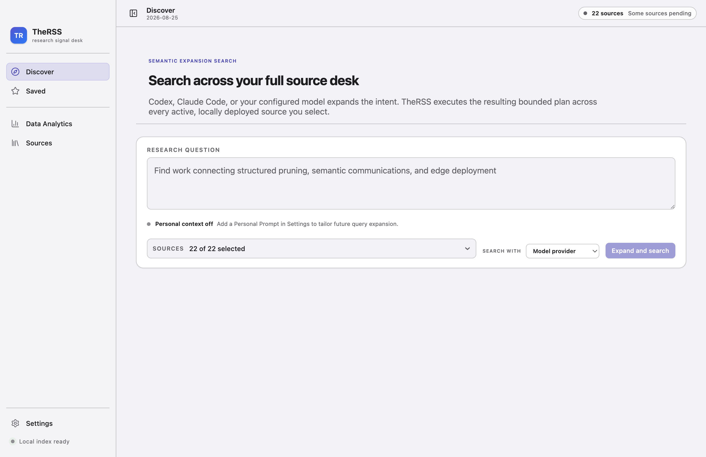

# TheRSS

TheRSS 是一个本地优先的研究发现桌面应用：你可以用自然语言描述研究问题，让自定义模型、Codex 或 Claude Code 生成可检查的语义扩展计划，再由 TheRSS 在 22 个通过日期化部署验证的信息源中执行受控检索、筛选和排序。

> 当前是个人测试版（v0.2.0）。arXiv 摘要、GitHub 元数据和模型输出只用于发现与初筛，不能替代全文阅读、代码审计或实验复现。



## 当前可用能力

- 在 **Discover** 中输入自然语言研究问题，选择自定义模型、Codex 或 Claude Code 生成受限、可检查的扩展计划。
- 在 **Settings** 的 Personal context pane 中保存本机 Personal Prompt；Discover 会将它作为辅助上下文，但当前问题始终是主指令。
- 从当前 22 个已验证信息源中全选或逐项选择。arXiv/GitHub 执行定向查询；Hugging Face 与 19 个固定 RSS/HTML 来源先获取有界近期内容，再由 TheRSS 本地确定性筛选。
- 来源选择默认收起并显示确切选中数；搜索完成后先展示全宽排名结果，再按需展开检索计划、模型溯源和 22 个来源的独立状态。
- 搜索期间显示 planner 阶段和真实的逐来源完成数；可取消悬挂任务，并只重试 failed、partial 或 canceled 来源，不会再次调用 planner 或重跑成功来源。
- 按论文、GitHub 仓库或其他记录类型筛选结果；只有显式保存后才进入 **Saved**。
- 在 **Data Analytics** 中分别查看 lifetime returned records、最近 7 个本机日历日的返回记录量、保留的历史 Today 统计，以及做过深度分析的内容和所用模型/本地代理；可重开历史 artifact，并看到 current/stale 来源哈希状态。
- 使用 **⌘F / Find Local Research** 搜索本机 SQLite 中的 Saved、Discover 会话和 analysis 内容；该流程不调用模型、来源适配器或网络。
- 在 **Sources** 中浏览和筛选同一组 22 个保留来源（A=7、B=15、C=0）；目录成员资格、日期化验证、当前记录健康和本机缓存时间分别表达。
- 在 **Settings** 配置 OpenAI-compatible（包括兼容的 DeepSeek 端点）或 Anthropic-compatible 模型；保存前可以显式测试连接，并可明确替换或清除受保护凭据。
- 对符合条件的 arXiv 论文使用 **Promote to llm-wiki**：TheRSS 先下载发现记录对应的精确版本 PDF，调用本地 Codex 生成全文分析并展示目标路径预览；只有用户再次确认后，才按照 vault 的治理规则写入 PDF、来源 sidecar、L2 论文笔记、Topic/Method 反向链接和审计记录。
- 通过只读 Model Context Protocol（MCP）服务向 Codex、Claude Code 或其他兼容客户端开放本地候选项。
- 所有 Discover 会话、Saved 状态和分析记录仅保存在本机；当前不提供账号登录或跨设备同步。
- 控件、文本选区和焦点环跟随系统设置中的强调色（System Settings > Appearance），并在用户更改时实时更新；各视图自身的标识色（Discover 蓝、Saved 琥珀、Sources 青、Analytics 靛）保持不变。
- 菜单栏提供 macOS 标准命令：Help 菜单、View 缩放（⌘0/⌘+/⌘-）、Dismiss Selected（⌘⌫）；Save Selected 改用 ⇧⌘D，把 ⌘S 让回给系统通用的“保存”语义。
- 界面统一使用 macOS Apple 系统字体：正文与控件使用 SF Pro Text，展示标题使用 SF Pro Display；应用不再打包第三方字体文件。
- 顶部上下文状态区根据当前页面显示一组紧凑、带文本标签的本地状态：Discover 展示 22 个来源的记录健康，Saved 展示保存数与当前来源过滤，Analytics 明确标注 local-only/no-telemetry，Sources 展示需要关注的来源数，Settings 保留未保存修改提醒；它不新增后台轮询或第二套状态存储。
- 侧栏可以折叠，并支持鼠标拖动或键盘在 184–360 px 范围内调整宽度；Settings 固定在底部应用工具区、紧邻来源状态，不会打断主要研究导航。
- 在 macOS 上构建并以可回滚方式安装 `~/Applications/TheRSS Dev.app`，升级前自动备份 SQLite 数据库。

## 立即运行

要求：macOS、Node.js 24.15 以上或 Node.js 26、npm。

```bash
git clone https://github.com/dtjgp/TheRSS.git TheRSS
cd TheRSS
npm ci
npm run dev
```

第一次打开后：

1. 在 **Settings** 中按需保存 Personal Prompt，并设置自定义 API 的协议、基础 URL、模型名和 API key；先运行 **Test connection** 再保存。已登录的 Codex 或 Claude Code 也可直接作为本地 runner。
2. 在 **Discover** 中输入研究问题；默认会搜索全部 22 个来源，按需展开来源选择器缩小范围。
3. 选择 runner 后执行扩展搜索；先检查排名结果与匹配原因，再展开 **Search details** 查看计划、溯源和逐来源状态。
4. 把需要继续阅读的记录显式加入 **Saved**，并在条目详情中按需执行分析。
5. 对准备进入知识库的 arXiv 论文点击 **Promote to llm-wiki**；先审阅全文分析等级、blocker 和目标路径，确认无误后再执行本地写入。
6. 在 **Data Analytics** 中区分 lifetime returned records、最近 7 个本机日历日的返回记录量和深度分析记录；点击历史条目可重开原始 artifact 并检查 freshness。
7. 使用 **⌘F** 在本机统一搜索 Saved、Discover 和分析证据。
8. 在 **Sources** 中按名称、优先级、完整研究方向或记录健康检查已部署来源及其近期内容。

API key 不会返回给渲染进程，也不会以明文写入 SQLite；应用使用 Electron `safeStorage` 加密后保存密文。远程模型地址必须使用 HTTPS，只有回环地址可使用 HTTP。

应用不会在启动时隐式发起 22 个来源请求。每次外部检索都由 Discover 中的显式操作触发；失败不会删除上一轮会话或 Saved 数据。

## 当前验证状态（2026-08-26）

- 完整质量门禁通过：60 个测试文件、402 个测试。覆盖率统计范围为 `src/core` 与 `src/shared`：statements 90.29%、branches 80.15%、functions 93.64%、lines 93.20%。Electron 主进程、preload、渲染层与 MCP 入口不计入该百分比，由类型检查、渲染层单元测试和 Electron E2E 分别覆盖。
- 最近一次真实联网来源复检为 2026-08-19，最终通过 22/22 来源：arXiv 定向检索返回 3 条、近期批次 200 条，GitHub 返回 25 条，其余配置来源最终通过 20/20。
- 科学网使用官方 HTTPS RSS；C114 使用固定 HTTPS 桌面首页、移动端故障回退、受限 `gb18030` 解码和专用纯文本归一化器。
- Electron 端到端流程 2/2 通过，覆盖 820 px 最小宽度、顶部上下文状态、四指标 Analytics 摘要、历史 artifact 重开、Command-F 本地搜索、Settings 底部工具区及侧栏几何位置、侧栏缩放/折叠、Settings/Provider、Personal Prompt、个性化 Discover、Saved 可调分栏、Sources health、forced colors、200% zoom、窗口恢复、llm-wiki 确认边界和 Apple 系统字体。
- llm-wiki 真实预览已使用精确 arXiv 版本完成 16 页 PDF 校验并返回 L2 ready 状态；该验证在确认前主动释放 stage，没有写入真实 vault。
- 未签名 macOS arm64 构建已覆盖安装到 `~/Applications/TheRSS Dev.app`，安装包与已安装 `app.asar` 哈希一致；SQLite 备份/当前库完整性、packaged smoke 和已安装二进制完整 E2E 均通过。公开分发仍需要有效 Developer ID、签名和公证。

详细的本轮来源证据见 [docs/verification/ACTIVE_SOURCE_SMOKE_2026-08-19.md](docs/verification/ACTIVE_SOURCE_SMOKE_2026-08-19.md)。

## 模型配置示例

| 场景                | 协议                 | 基础 URL 示例                                           | 模型示例                   |
| ------------------- | -------------------- | ------------------------------------------------------- | -------------------------- |
| OpenAI-compatible   | OpenAI-compatible    | `https://api.openai.com/v1`                             | 供应商支持的模型名         |
| DeepSeek-compatible | OpenAI-compatible    | `https://api.deepseek.com` 或供应商文档指定的 `/v1` URL | `deepseek-chat`            |
| Anthropic           | Anthropic-compatible | `https://api.anthropic.com`                             | 供应商支持的 Claude 模型名 |
| 本机服务            | OpenAI-compatible    | `http://127.0.0.1:11434/v1`                             | 本机服务提供的模型名       |

模型端点和模型名可能变化，请以供应商当前文档为准。TheRSS 会为 OpenAI-compatible 地址追加 `/chat/completions`，为 Anthropic-compatible 地址追加 `/v1/messages`。

## 安装与快速更新

开发时使用热更新：

```bash
npm run dev
```

构建并安装个人测试版：

```bash
npm run install:local
```

该命令会获得本机安装锁、构建未签名应用、备份并校验数据库、校验 Electron Framework 与 `app.asar` 哈希，并原子替换 `~/Applications/TheRSS Dev.app`；旧应用会保留为带时间戳的备份，成功后在 Application Support 中写入结构化回执。同一构建默认拒绝重复安装，确需演练时显式运行 `npm run install:local -- --force`。已有远程仓库后，可在干净的 `main` 工作树运行：

```bash
npm run update:local
```

它只允许 fast-forward 拉取，然后恢复锁定依赖、执行完整质量门禁，再重新安装。详细恢复流程见 [docs/LOCAL_UPDATE.md](docs/LOCAL_UPDATE.md)。

个人开发和本机测试**不需要**加入每年 99 美元的 Apple Developer Program。未签名应用可能触发 Gatekeeper；如确认应用是你刚刚从本项目构建的，可在 Finder 中右键应用并选择“打开”。不要全局关闭 Gatekeeper。面向他人的稳定自动更新需要 Developer ID 签名与公证。

## 连接 Codex / Claude Code

先运行一次 TheRSS 并构建 MCP 服务：

```bash
npm run build:mcp
npm run smoke:mcp
```

随后按 [docs/AGENT_SETUP.md](docs/AGENT_SETUP.md) 配置。当前 MCP 服务只暴露三个只读工具：`list_today_items`、`get_item` 和 `get_analysis_context`；它以只读模式打开本地 SQLite，不提供修改 triage、写回知识库或读取模型密钥的能力。

## 数据库是否需要单独搭建？

不需要。TheRSS 使用随桌面应用运行的本地 SQLite，不需要 PostgreSQL/MySQL、Docker、云数据库或手动执行建表 SQL。

- 第一次启动桌面应用时，Electron 主进程会打开 `app.getPath('userData')/therss.sqlite`；文件不存在时由 `better-sqlite3` 自动创建。
- `ResearchRepository` 随后在事务中执行 `CREATE TABLE IF NOT EXISTS` 和版本兼容迁移，并在迁移后检查外键完整性。
- 已有数据库会在新版本第一次启动时自动迁移；`npm run install:local` 在替换应用前会生成可回滚备份。
- MCP 服务刻意以只读方式连接，不负责创建或迁移数据库。因此配置 MCP 前只需先正常打开一次 TheRSS。

日常使用不需要维护数据库进程。只有迁移设备、手工恢复或排障时，才需要直接处理 SQLite 文件。

## 质量门禁

```bash
npm run check
npm run test:e2e
npm run smoke:sources
npm run smoke:configured-sources
npm run smoke:credentials
npm run smoke:mcp
npm run smoke:package
npm audit --audit-level=high
```

`smoke:sources` 与 `smoke:configured-sources` 会访问真实来源，其他自动化测试使用确定性 fixture。项目要求覆盖率统计范围（`src/core` 与 `src/shared`）的 statements、branches、functions 和 lines 均不低于 80%，该阈值由 `vitest.config.ts` 强制。

## 数据与边界

- 主数据库：`~/Library/Application Support/therss/therss.sqlite`
- 更新备份：`~/Library/Application Support/therss/backups/`
- 安装位置：`~/Applications/TheRSS Dev.app`
- 本地数据库和密钥密文不会提交到 Git。
- 当前版本没有账号登录或云同步入口；更换设备时不会自动迁移本机状态。
- Discover 只让所选模型/本地代理生成受限检索计划；实际外部请求由固定主机、限时限量的 TheRSS 数据源适配器执行。模型输出与源元数据仍是发现证据，不代表全文或代码已经验证。
- “搜索全部 22 个来源”不等于全网或完整历史搜索：固定 feed/API 来源只提供各适配器的有界近期窗口，再接受本地语义筛选。
- Data Analytics 完全读取本地 SQLite，不发送遥测。“搜索结果量”统计每次已完成搜索返回的记录；历史 Today 数据被保留但不会被推测或改写成 Discover。
- Sources 是随应用发布的 22-source 只读目录；原始 105-entry catalog 仅作为休眠版本元数据保留，不代表其余来源已经部署。
- llm-wiki 写回已经实现为本地主进程拥有的确认式能力：预览失败或校验不通过时不会写入 vault；Zotero 写回仍未集成。TheRSS 不替代 Zotero 或 Obsidian。

产品范围见 [PRODUCT.md](PRODUCT.md)，架构见 [docs/DESIGN.md](docs/DESIGN.md)，需求验收见 [docs/REQUIREMENTS_TRACEABILITY.md](docs/REQUIREMENTS_TRACEABILITY.md)。
llm-wiki 推送的证据等级、路径事务和回滚规则见 [docs/capabilities/llm-wiki-paper-promotion.md](docs/capabilities/llm-wiki-paper-promotion.md)。

## License

MIT
