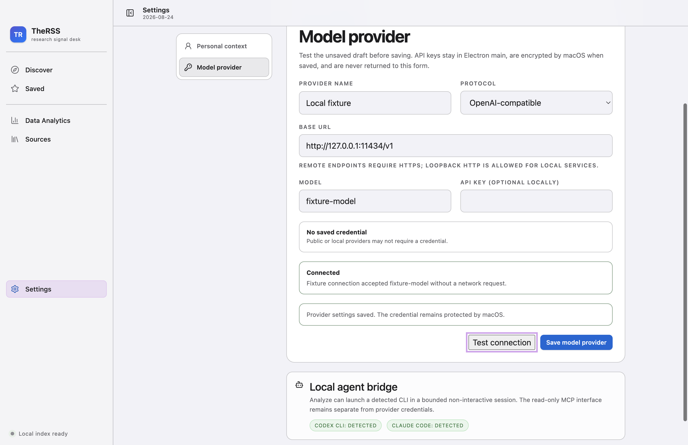
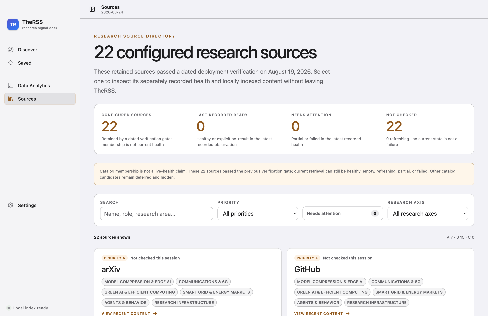
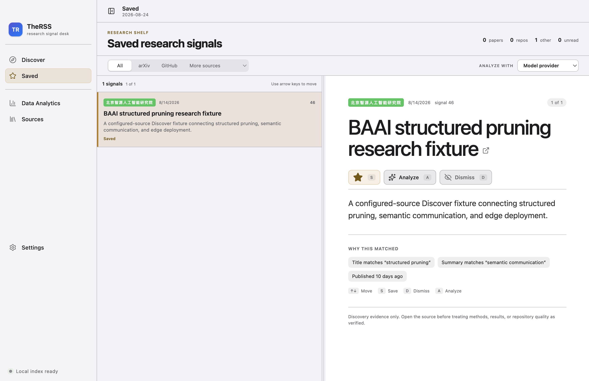
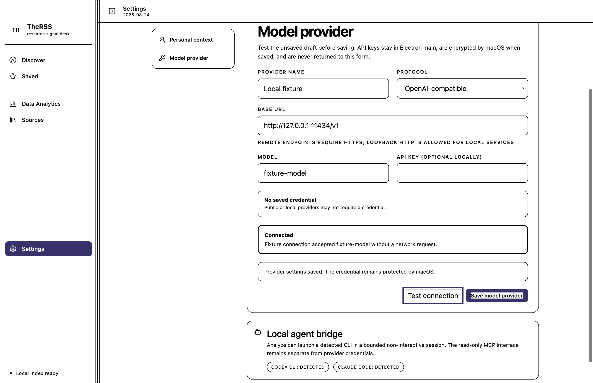

# TheRSS Complete Audit Remediation Report

Date: 2026-08-24
Status: complete and installed as the local unsigned personal beta

## Outcome

Every open application finding from the 2026-08-24 software-design audit, post-Slice-A review, and
Slice B remaining-scope list is closed. The work preserves the accepted Apple system typography,
restrained semantic palette, local-first storage, evidence boundaries, and typed renderer/main
isolation.

The final app is installed at `/Users/dtjgp/Applications/TheRSS Dev.app`. No commit, push, public
release, live source run, live provider request, or llm-wiki write was performed.

## Closed Finding Matrix

### Settings and Provider

- Discover and Saved are the two primary destinations. Analytics and Sources are secondary research
  utilities; Settings is a separate utility entry and remains reachable through `Command-,`.
- Settings has focused Personal context and Model provider panes.
- Unsaved edits are visible and guard in-app navigation, window close, and application quit.
- Provider fields expose field-linked `aria-invalid`/`aria-describedby` errors and save status.
- Test Connection runs only after an explicit click, validates the unsaved draft through the same
  HTTPS/loopback rules, never saves implicitly, and classifies success, authentication, DNS,
  missing model/route, timeout, protocol mismatch, and other network failure.
- Credential clear and replacement are explicit. A saved key is never reused for a changed endpoint
  or protocol, preventing cross-host credential disclosure.

### Sources

- `Ready now` is replaced by `Last recorded ready`; each source can expose its independently
  recorded observation time and bounded failure reason.
- The sidebar health summary is an actual button and opens Sources with the controlled
  Needs-attention filter.
- Source refresh synchronizes the latest dashboard health instead of leaving the directory stale.
- Research-axis chips use full names. Adapter notes and Folo origin are removed from primary cards
  and retained in a collapsed Source provenance disclosure.
- The registry copy names the dated August 19, 2026 deployment verification and does not imply live
  health.

### Workspace and State

- The Saved list/detail divider supports pointer drag, Arrow keys, Shift acceleration, Home/End,
  persistence, narrow-window capping, rollback on interrupted drag, and storage failure fallback.
- Window bounds and maximized state persist through an atomic validated file, reject corrupt or
  off-screen state, and clamp oversized bounds to the current display work area.
- llm-wiki promotion receipts render in a separate status line below the one-row action controls.

### Accessibility and Visual System

- Added `prefers-contrast: more` and `forced-colors: active` behavior with visible focus, selection,
  status, and error boundaries.
- The forced-colors verifier uses a real keyboard focus path. Chromium's accessibility tree exposes
  the Settings heading, both tabs, and connection controls to VoiceOver-facing platform semantics.
- 200% Electron zoom has no document or main-workspace horizontal overflow; the minimum desktop
  width remains usable.
- Critical uppercase labels are at least 11 px. Sources summary cards share one grouped surface,
  cards have quieter borders, and full research-area labels replace tooltip-only abbreviations.

## Maintainability

- `ModelEditor` was removed from the 970-line App orchestration and replaced by focused
  `SettingsView` and `ResizableSplitPane` components. `App.tsx` is now below the repository's
  800-line limit.
- The former 3,662-line stylesheet is split into base, Settings, Discover, Analytics, Sources,
  workspace, and accessibility files; every stylesheet is below 800 lines.
- `PRODUCT.md` and `docs/DESIGN.md` now use Settings and dated/current-health terminology consistent
  with the renderer.

## Verification

- Full gate: 52 files / 328 tests passed.
- Coverage: 90.46% statements, 80.47% branches, 93.99% functions, 93.43% lines.
- Formatting, ESLint, TypeScript, Electron main/preload/renderer build, and MCP build: passed.
- Electron source-build E2E: 2/2 passed.
- Production `npm audit --omit=dev --audit-level=high`: zero vulnerabilities.
- Secret-addition, debug-output, unsafe renderer-boundary, whitespace, and diff scans: clean.
- Installed executable packaged smoke: passed.
- Installed-binary desktop E2E: 1/1 passed.

## Installation Evidence and Rollback

- Installed app: `/Users/dtjgp/Applications/TheRSS Dev.app`
- Version / bundle ID: `0.2.0` / `dev.dtjgp.therss`
- Release and installed `app.asar` SHA-256:
  `660b14781f643a6c0a2d7cb51e53afb5472f3df6b299d079bf518537054eafa5`
- Superseded app cleanup: the single validated
  `/Users/dtjgp/Applications/TheRSS Dev.backup-2026-08-24T14-14-54-159Z.app` was permanently removed
  at the user's request after confirming the active bundle/hash and both database integrity checks.
- App rollback boundary: no old application bundle remains; rollback data is limited to the retained
  SQLite backup below and the published Git history/source build.
- SQLite backup:
  `/Users/dtjgp/Library/Application Support/therss/backups/therss-2026-08-24T14-14-54-159Z.sqlite`
- Backup and live SQLite `PRAGMA integrity_check`: `ok`
- Signing boundary: unsigned personal beta; no valid Developer ID Application identity was present.

## Figma Writeback Boundary

The existing board remains available at
<https://www.figma.com/board/vf2F6NPHj5WDCynEvYYPvT>. The authenticated Starter/View account hit
the Figma MCP tool-call limit before the final append, so no board mutation was claimed. All final
screenshots and the closed finding matrix are durably stored in this audit directory and can be
appended when the plan limit resets or the seat is upgraded.
