# TheRSS Slice A 后产品复审

审计日期：2026-08-24
对象：当前源码构建的 Electron renderer
模式：UX + 视觉 + 可访问性 + 软件设计联合复审

## 0. 结论

Slice A 的四项修复仍然有效，没有发现回归。但这次复审确认了三个应立即进入下一开发批次的
问题：

1. **跨页面滚动位置泄漏**：从已滚动的 Models 页面切换到 Analytics/Sources，会直接落在
   页面中部，标题和关键摘要卡位于屏幕上方不可见。
2. **Discover 大结果集仍不可扩展**：100 条结果会生成 100 个 article、204 个按钮、2,169 个
   DOM 节点和 30,647 px 滚动长度，没有分页或虚拟化。
3. **Saved 的决策动作仍被完整摘要压到首屏之外**：593 px 可见详情窗中，502 px 被摘要占用，
   Save/Promote/Analyze/Dismiss 初始不可见。

这三个问题比重新换视觉风格、增加新来源或扩展分析能力更优先。

## 1. 流程证据与健康度

### Step 1 — 当前真实 Discover：部分健康

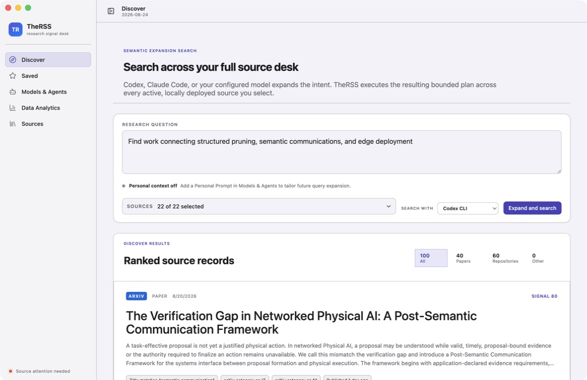

搜索输入、runner、来源数量和结果证据层级清楚；一次恢复 100 条完整卡片仍然过重。

### Step 2 — 100 条结果压力状态：不健康

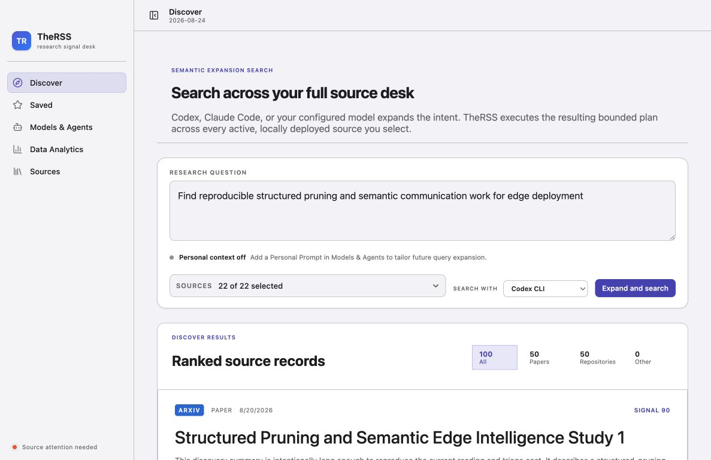

量化结果：100 articles、204 buttons、101 个 `h2`、2,169 个 DOM 后代、30,647 px 滚动区域，
且没有分页。视觉上首屏只能完成一次粗略浏览，键盘与辅助技术路径更长。

### Step 3 — Saved 首屏：部分健康

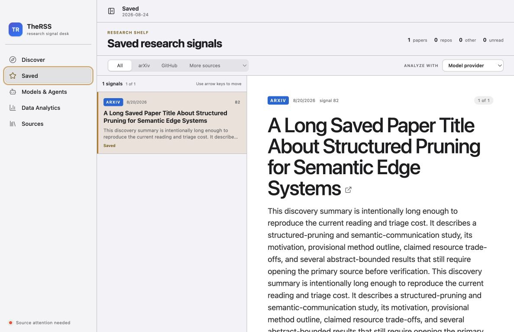

列表—详情模式成立，但超大标题与完整摘要把决策动作推到首屏之外。

### Step 4 — Saved 动作区：不健康

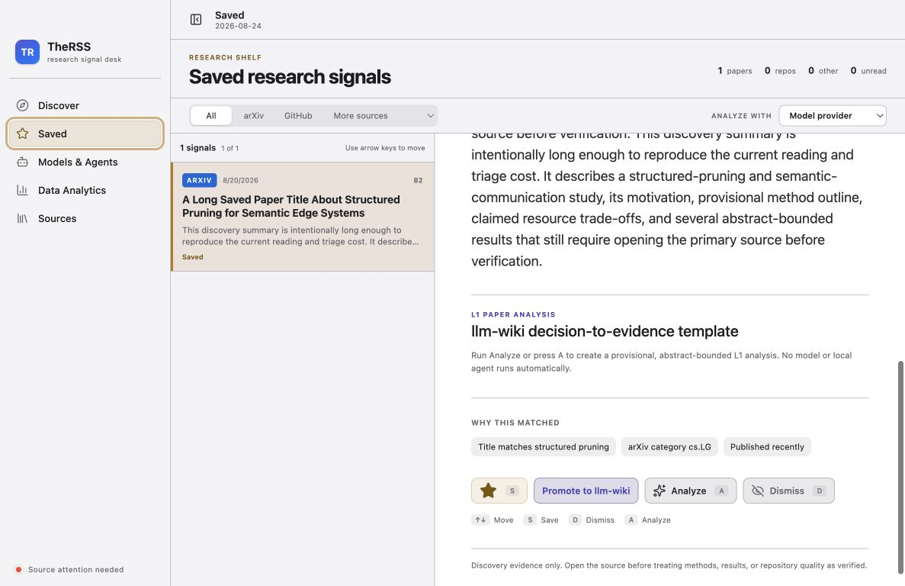

用户必须滚过摘要才能 Save、Promote、Analyze 或 Dismiss。核心 triage 动作应位于标题下方的
sticky action row，摘要默认显示 4–6 行并允许展开。

### Step 5 — Personal Prompt：健康

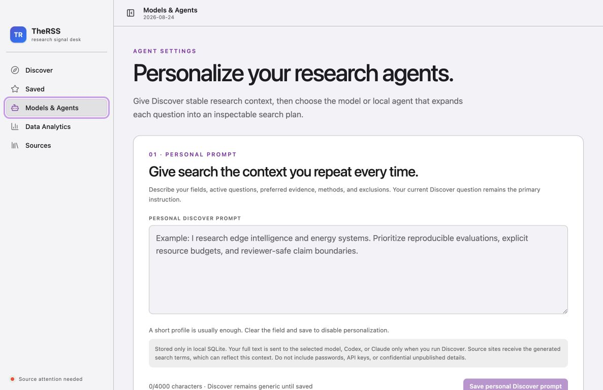

隐私边界、字符限制、placeholder 和保存禁用状态清楚；问题主要在信息架构，而不是表单
本身。

### Step 6 — Provider 设置：部分健康

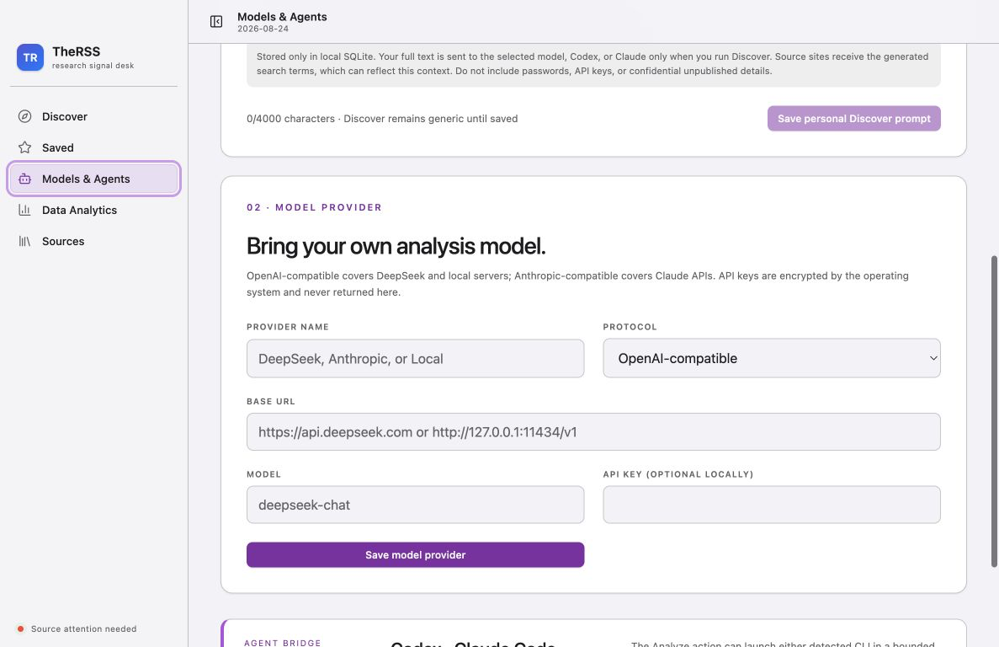

缺少 Test Connection、credential clear/replace、字段级错误定位、保存成功反馈与未保存修改
保护。用户只能保存后去其他流程发现连接失败。

### Step 7 — Analytics 跨页面进入：不健康

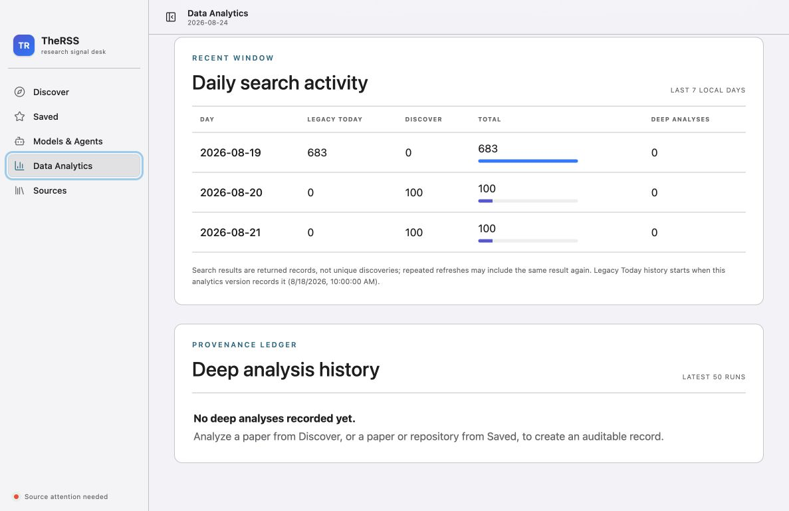

从已滚动的 Settings 进入时，`main.scrollTop` 保留为 405.5，Analytics header 位于 y=-311.5；
页面标题、说明和三张 summary card 全部不可见。

### Step 8 — Sources 跨页面进入：不健康

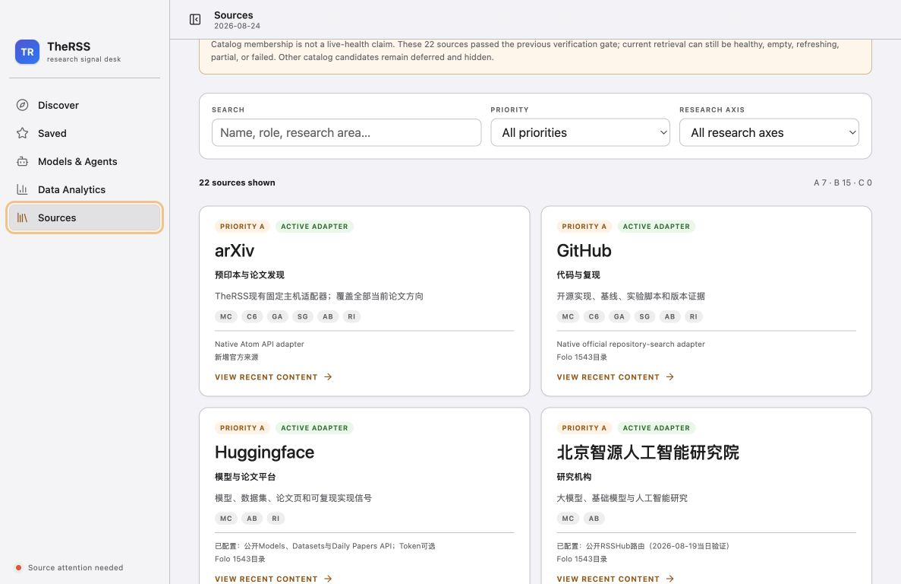

继续切换到 Sources 后，目录标题和全部健康摘要卡仍在屏幕上方。导航到新的一级目的地应重置
到顶部，或实现可靠的 per-view scroll restoration。

### Step 9 — 820 px 最小宽度：健康

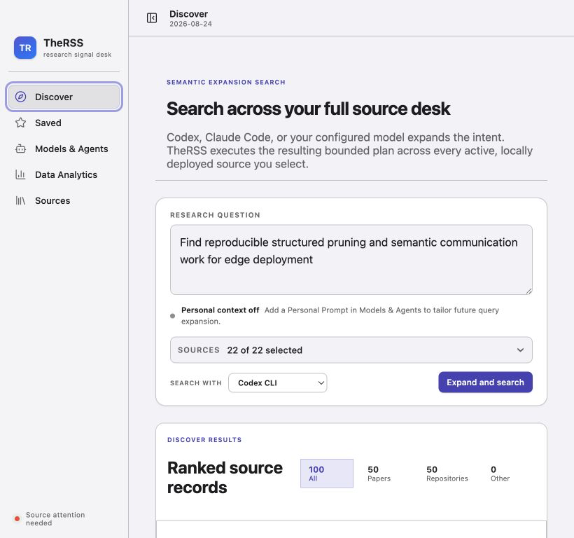

来源数量完整可见，runner 与 CTA 位于第二行；Slice A 的响应式修复有效。

### Step 10 — Sources 正常顶部状态：部分健康

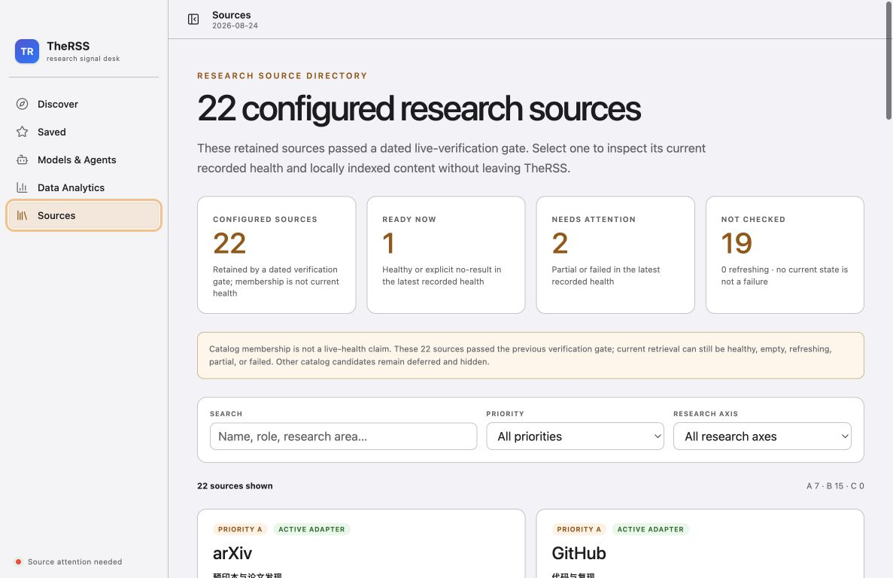

状态分层明显改善。但 `Ready now` 没有 observation timestamp，可能把旧的 recorded health
误读为实时状态；左下角 `Source attention needed` 也无法点击进入异常来源。

### Step 11 — Analytics 正常顶部状态：健康

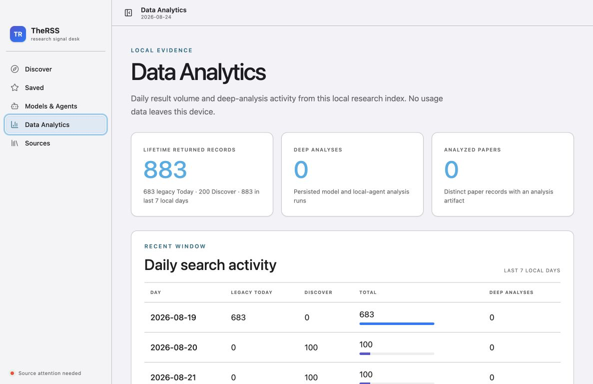

Lifetime、最近 7 天、Today/Discover 和 returned-record 边界现在表达清楚。

## 2. 优先级清单

| ID  | 优先级 | 问题                               | 推荐修改                                                                             | 验收证据                                        |
| --- | ------ | ---------------------------------- | ------------------------------------------------------------------------------------ | ----------------------------------------------- |
| R1  | P0     | 跨 view 滚动位置泄漏               | 一级导航切换时 reset main scroll；如需恢复则按 view 独立保存                         | Models 滚动后切 Analytics/Sources，heading 可见 |
| R2  | P0     | Discover 同时渲染 100 张完整卡片   | 20–25 条首批 + 虚拟化/分页；compact list-detail；结果类型/来源/日期过滤              | 100 条 fixture 的 DOM、滚动、键盘和性能契约     |
| R3  | P0     | Saved 动作初始不可见               | 标题下 sticky actions；摘要 4–6 行折叠；保留全文展开                                 | 长摘要 fixture 首屏可见四项动作                 |
| R4  | P1     | Discover heading 层级扁平          | 结果区保持 `h2`，每张卡改为 `h3`；加入 skip/roving 或虚拟化策略                      | accessibility tree 不再出现 101 个同级 `h2`     |
| R5  | P1     | Models/Provider 没有 Settings 闭环 | 独立 Settings panes、Command-,、unsaved guard、Test Connection、credential clear     | provider 成功/认证/DNS/超时 fixture 矩阵        |
| R6  | P1     | Source health 缺时间与入口         | `Ready now` 改为 `Last recorded ready` 或显示 observed-at；footer 可点击并过滤异常源 | stale/failed/partial/current 时间矩阵           |
| R7  | P1     | Source 视觉术语偏工程化            | 轴显示全称；adapter/Folo 移入 provenance disclosure；统一 locale                     | 无 tooltip-only/内部术语主导的卡片截图          |
| R8  | P2     | list-detail 与窗口状态不可调       | 增加可拖动列表/详情 divider，恢复 window/pane bounds                                 | 重启与宽窄窗口状态测试                          |
| R9  | P2     | 高对比与字段错误证据不足           | `prefers-contrast`、forced colors、`aria-invalid`/describedby、VoiceOver/200% zoom   | 专项可访问性矩阵                                |
| R10 | P2     | renderer 与文档持续漂移            | 拆 view orchestration/CSS；PRODUCT 使用 dated verification 术语                      | 文件边界、视觉回归和文档一致性检查              |

## 3. 推荐的下一实施批次

### Slice B1 — Navigation correctness

先单独修 R1。改动小但用户影响直接，应加入跨视图滚动回归测试。

### Slice B2 — Daily triage efficiency

联合修 R2、R3、R4：Discover compact/virtualized list-detail、Saved sticky actions、摘要折叠和
正确 heading 层级。这是一组共享组件与交互模型的改动，不应拆成互相冲突的零散 CSS。

### Slice C — Settings and provider lifecycle

完成 R5，再处理 R6/R7。Provider Test Connection 必须保持 bounded、无 key 回显，并区分
DNS、认证、模型不存在、超时和协议不兼容。

## 4. 证据限制

- 真实 Electron 窗口用于确认当前开发构建；复杂状态使用同一当前编译 renderer 的隔离
  deterministic fixture，未接触真实 SQLite 或外部来源。
- 没有执行 live source/provider、llm-wiki 写入、安装、提交、推送或发布。
- 本轮不是完整 WCAG 结论；VoiceOver、forced colors、Increase Contrast 和 200% zoom 仍需
  专项验证。
- `09-navigation-scroll-state.png` 为重复画面，未作为接受证据。
