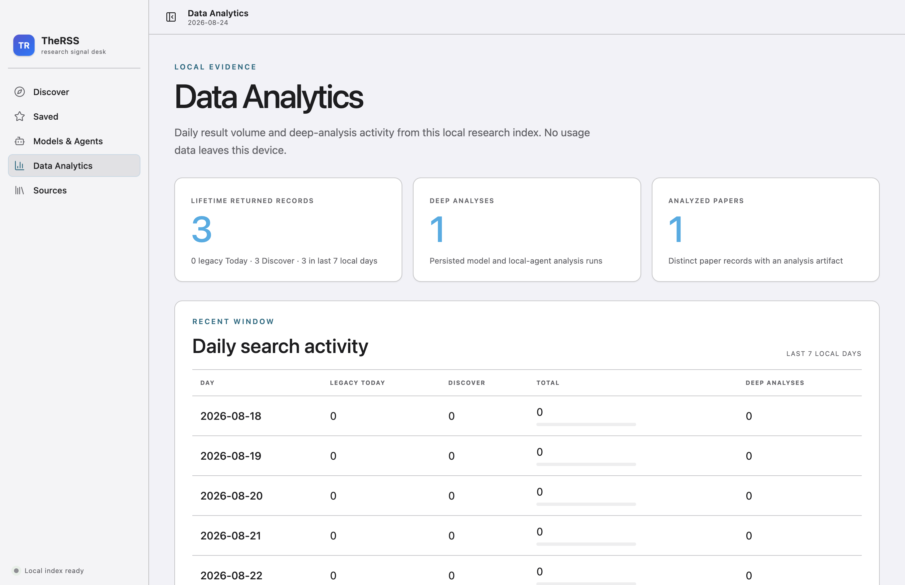
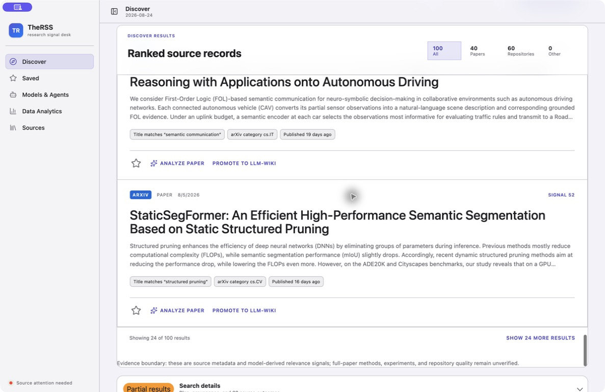
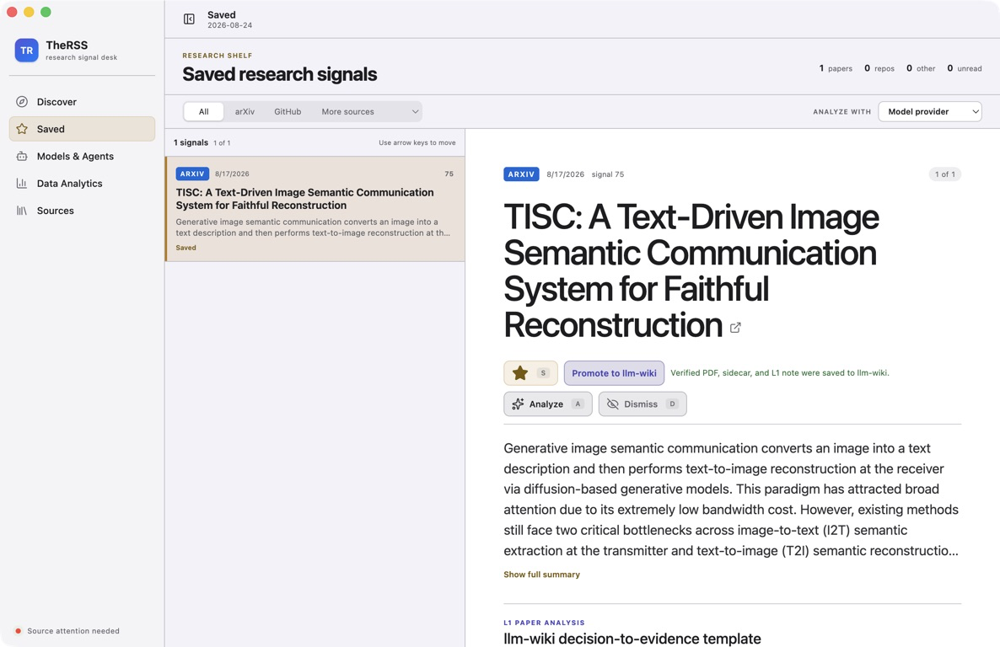

# TheRSS Post-Audit Slice B Implementation Report

Date: 2026-08-24
Status: implemented and verified in the current development build

## Outcome

The next high-priority UX slice is complete:

1. Primary navigation resets the shared workspace to the top.
2. Discover initially renders 24 results and progressively reveals up to 24 more.
3. Discover card headings are `h3` under the result-section `h2`.
4. Saved triage actions appear directly below the title and remain sticky while scrolling.
5. Long Saved summaries collapse to six lines with an explicit accessible disclosure.

No persisted result, ranking, filter, provenance, or source evidence was removed.

## R1 — Navigation correctness

Before, a scrolled Settings page could open Analytics with its title at y=-311.5. Navigation now
resets `main.scrollTop` and `scrollLeft` before changing the view.

## R2/R4 — Discover scale and hierarchy

The initial DOM is bounded to 24 cards instead of the entire persisted snapshot. The sticky footer
reports the visible/total count and offers the next bounded batch. Card summaries remain visually
limited to three lines, and their headings are now `h3`.

## R3 — Saved triage efficiency

Save, Promote, Analyze, and Dismiss now follow the title. A long summary is six-line clamped until
the user chooses `Show full summary`; the action row remains sticky within the detail pane.

## Figma audit update

The existing board now contains a second section with the newly discovered problems, the healthy
820 px control, implementation order, three verified after-states, and the verification closure:

<https://www.figma.com/board/vf2F6NPHj5WDCynEvYYPvT>

## Verification

- Focused App/style tests: 40/40 passed.
- Full gate: 49 files / 298 tests.
- Coverage: 90.43% statements, 80.12% branches, 93.86% functions, 93.33% lines.
- Formatting, lint, TypeScript, main/preload/renderer/MCP builds: passed.
- Electron desktop and minimum-width E2E: 2/2 passed.
- Fresh after-state screenshots: inspected and accepted.

## UI / UE aesthetic assessment

The interface is already aesthetically coherent. Its strongest quality is restraint: Apple system
typography, grouped surfaces, light separators, low-noise motion, and semantic view accents make it
feel like a research utility rather than a generic web dashboard.

The changes in this slice improve beauty mainly through structure:

- fewer simultaneously rendered records;
- shorter visible summaries;
- clearer result hierarchy;
- decision controls placed near the title;
- predictable view entry.

Remaining visual improvements should focus on typography scale, terminology, locale consistency,
and reducing repeated card borders. Adding gradients, new fonts, heavier shadows, or decorative
motion would weaken the current product identity.

## Remaining scope

- Settings/Provider lifecycle and security-sensitive connection testing.
- Source observed-at timestamps, attention filtering, and terminology cleanup.
- High-contrast/forced-colors/VoiceOver/200% zoom validation.
- Resizable list/detail pane and window-state restoration.
- Renderer/CSS decomposition and PRODUCT terminology alignment.

The installed `TheRSS Dev.app` was not replaced, and no commit or push was performed.
