# TheRSS 软件设计审计

审计日期：2026-08-24
模式：UX + 视觉设计 + 可访问性联合审计
对象：当前安装的 `TheRSS Dev.app` 与当前仓库实现

## 0. 结论

TheRSS 不需要推倒重做。产品边界、证据表达、macOS 视觉语言和核心 Discover → Saved
闭环已经成立；当前最值得改的不是“更炫”，而是四个会直接影响使用效率和可信度的问题：

1. 最小窗口宽度下 Discover 来源选择器发生真实截断；
2. `live-verified`、当前 source health 与缓存时间被混成一个状态；
3. 一次展示 100 张完整结果卡，远超每日筛选所需的信息密度；
4. Saved 的主操作被完整摘要推到首屏之外。

先修这四项，再调整导航与 Settings，收益显著高于重新换配色、字体或视觉风格。

## 1. 插件与审计边界

- Product Design：以本轮截图为唯一视觉证据，逐步检查 UX、视觉和可访问性。
- Computer Use：检查真实安装的 Electron 窗口、原生菜单与五个产品表面。
- Browser：在当前编译产物的隔离本地 fixture 中检查 820 px 最小宽度、DOM、深色模式与
  对比度；fixture 不接触真实 SQLite 或外部来源。
- UI/UX 规则库：只采用与本产品一致的清晰度、扫描效率、对比度、局部反馈和 reduced
  motion 原则；保留已接受的 Apple system typography，不采用通用 SaaS 字体建议。
- Open Design：它的当前能力是生成或改造设计。本轮只获授权做分析，因此没有启动
  Cloud、Local Codex 或 secure BYOK 生成，也没有产生费用或新原型。

## 2. 流程证据与健康度

### Step 1 — Discover：部分健康

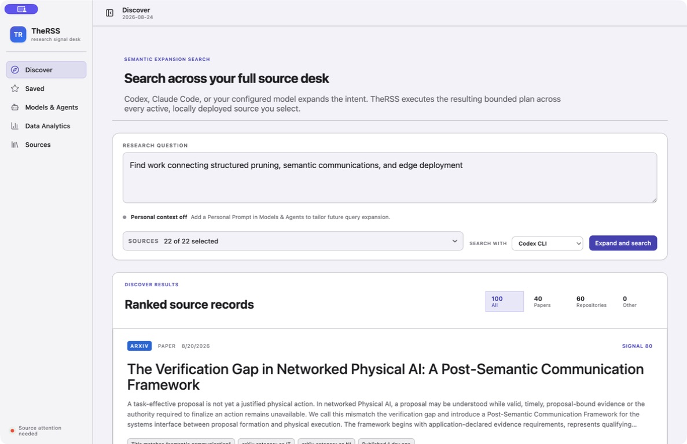

优点：问题、来源数、runner、结果类型与证据边界都清楚。
问题：恢复的 session 一次呈现 100 条完整卡片；首屏已经从“提出问题”迅速变成大规模
阅读列表，不利于快速筛选。

### Step 2 — Saved 首屏：部分健康

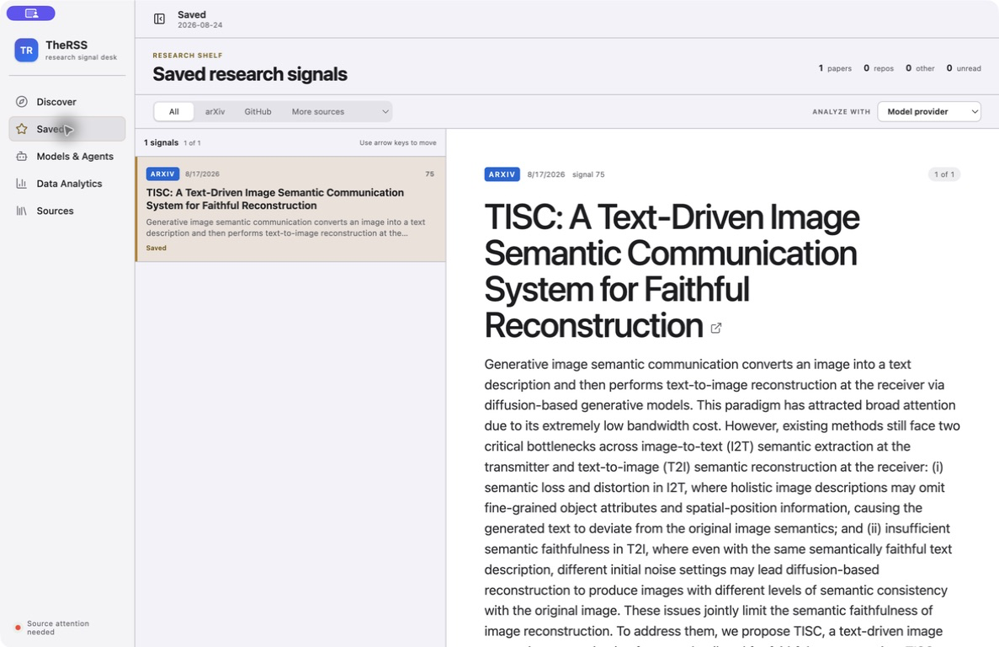

优点：列表—详情结构、选中状态、来源过滤和分析 runner 很适合研究筛选。
问题：详情标题和完整摘要占据几乎全部首屏，关键动作不可见。

### Step 3 — Saved 动作区：需要改进

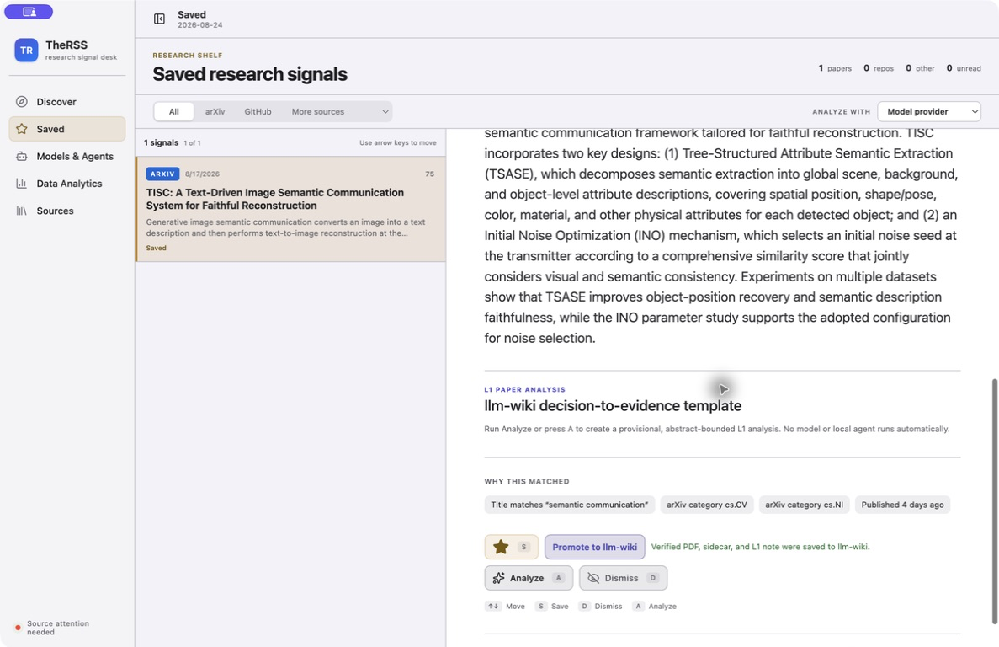

用户必须滚过完整摘要后才能看到 Save、Promote、Analyze、Dismiss。对于“决定是否保留、
分析或丢弃”的产品，这些动作应跟随标题/摘要开头，而不是跟随全文末尾。

### Step 4 — Personal Prompt：健康

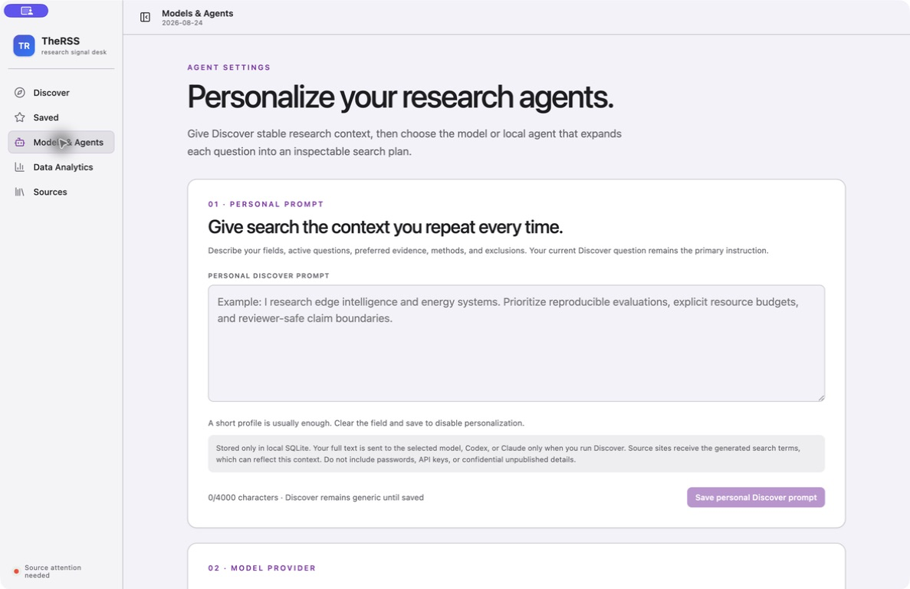

信息发送边界写得清楚，字符限制、禁用状态与保存反馈方向正确。这个表面的问题主要是
它被当成主内容导航，而不是 Settings pane。

### Step 5 — Model Provider：部分健康

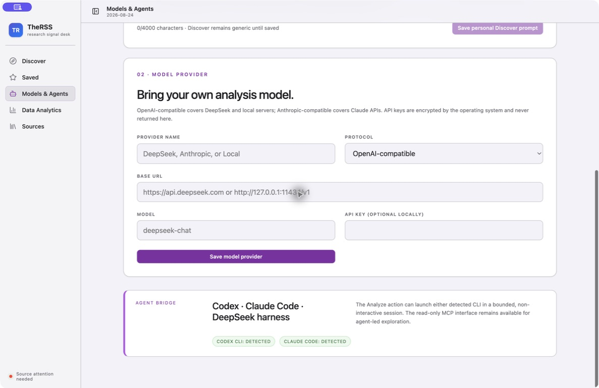

安全文案与协议/URL/模型分组清楚，但缺少 Test Connection、凭据清除/替换与更具体的
连接错误反馈；用户只能“保存后再去别处失败”。

### Step 6 — Data Analytics：基本健康

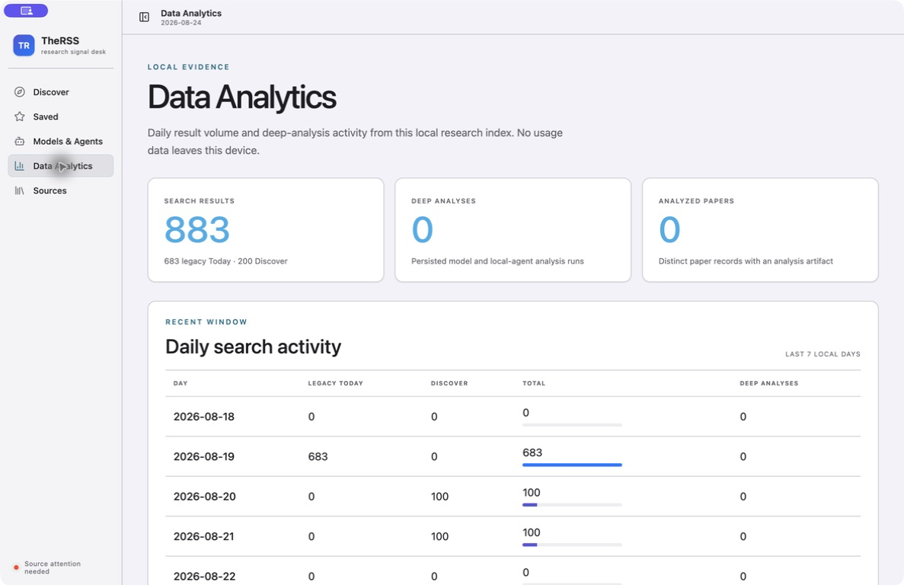

Today 与 Discover 分开、returned records 与 deep analyses 分开，证据表达诚实。主要问题是
`883 Search results` 没有标出它是 lifetime returned-record volume，容易被理解成最近七天或
唯一论文数。

### Step 7 — Sources directory：部分健康

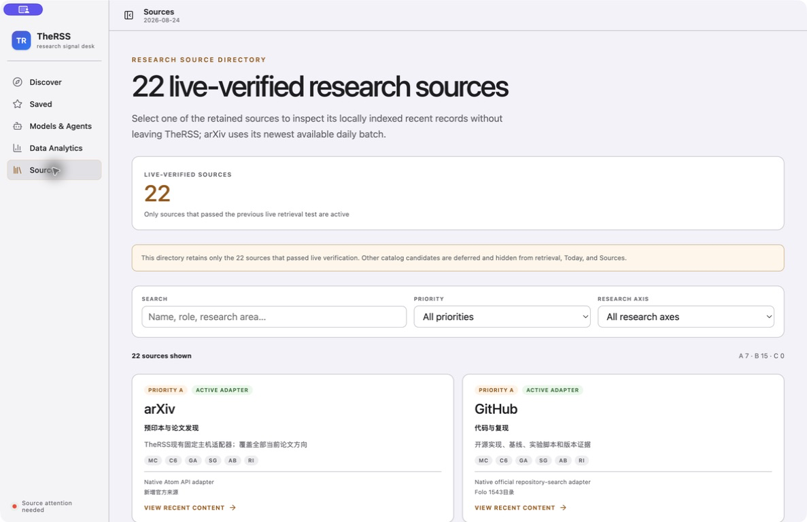

搜索、优先级与研究轴过滤成立，但 `live-verified` 像当前状态；`ACTIVE ADAPTER`、
`Folo 1543` 和 `MC/C6/GA/SG/AB/RI` 更像工程内部词汇，且中英混排没有统一语言策略。

### Step 8 — Source detail：可信度风险

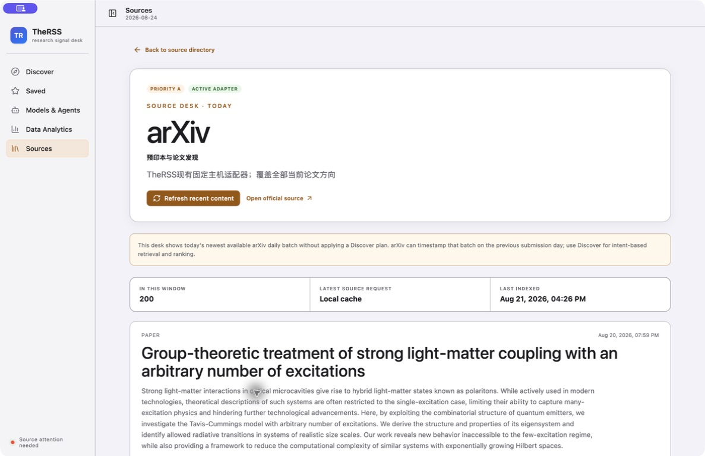

同一个窗口同时出现 `live-verified`、侧栏 `Source attention needed`、详情 `Local cache` 和
三天前的 `Last indexed`。这些事实并不矛盾，但 UI 没有解释它们的层级，用户容易把历史
验证误读为当前健康。

### Step 9 — 820 px 最小宽度：不健康

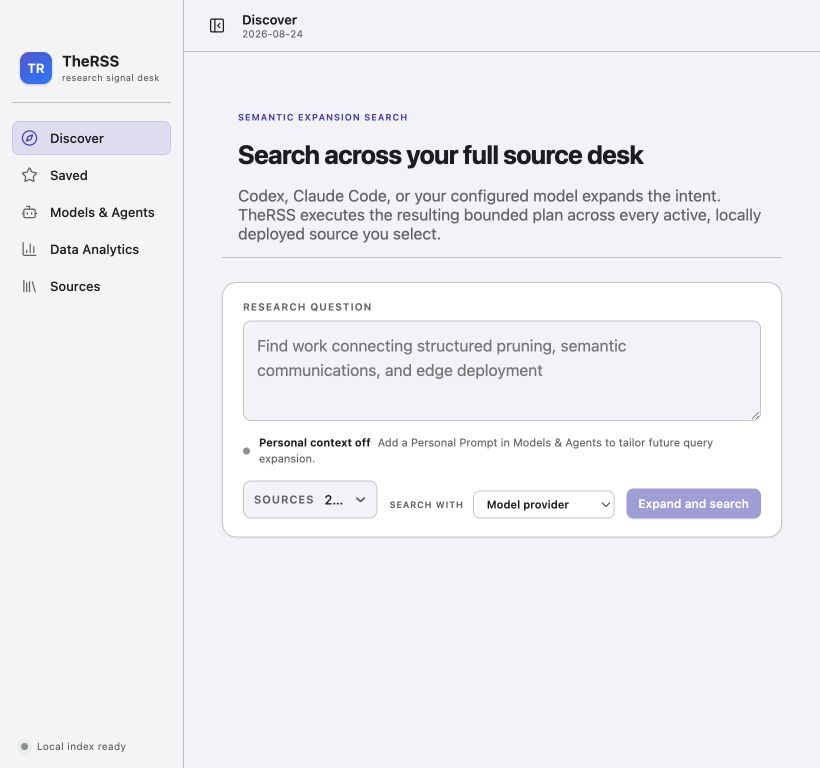

这是已确认的可见缺陷：来源摘要从 `22 of 22 selected` 截成 `2…`。当前
`.discover-controls` 固定为 `minmax(0, 1fr) auto auto`，而 860/920 px media rules 没有把这一
行改为两行或单列。

### Step 10 — 820 px Settings：基本健康

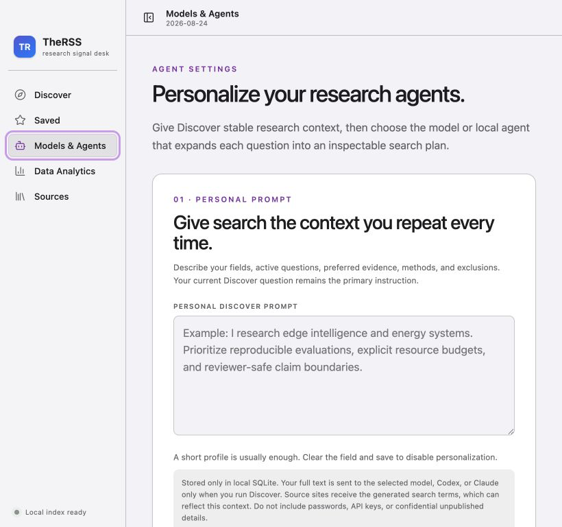

表单本身在最小宽度下能重排为单列；说明问题不是整套响应式失效，而是 Discover 控制行
缺少专门规则。

### Step 11 — Dark appearance：基本健康，有一处对比度风险

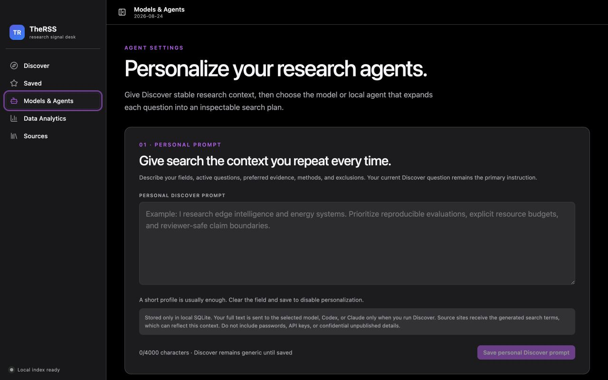

分层、边框与正文在深色模式下清楚。测得 Personal Prompt placeholder 对比度为 3.02:1；
它承载唯一的示例内容，建议达到普通文本的 4.5:1。其他抽样文本为 5.26:1–6.69:1。

## 3. 优先级清单

| ID  | 优先级 | 已确认问题                                | 推荐修改                                                                                                      | 验收证据                                       |
| --- | ------ | ----------------------------------------- | ------------------------------------------------------------------------------------------------------------- | ---------------------------------------------- |
| D1  | P0     | 820 px 下来源摘要截断                     | 小于 920 px 时把 runner + submit 放到下一行；来源选择独占一行                                                 | 820/920/1187 px 截图 + 可访问名称仍完整        |
| D2  | P0     | 历史验证、当前健康、缓存新鲜度混淆        | 标题改为 `22 configured sources`；分别显示 `verified at`、`current health`、`last successful index`、失败原因 | healthy/partial/failed/stale fixture 矩阵      |
| D3  | P0     | Discover 同时渲染 100 张完整卡片          | 首屏 20–25 条或虚拟列表；复用 compact list-detail；保持 filter/session 不重跑                                 | 100 条 fixture 的 DOM 数、滚动、键盘与性能测试 |
| D4  | P0     | Saved 主操作在完整摘要之后                | 标题下放 sticky action row；摘要默认 4–6 行，显式展开；证据/分析继续向下                                      | 1 条与多条 Saved 截图 + 键盘路径               |
| D5  | P1     | 主导航混入 Settings 与运维表面            | 一级保留 Discover/Saved；Sources/Analytics 降为 secondary；Models & Agents 进入 `Command-,` Settings          | 原生菜单、返回路径与状态恢复 E2E               |
| D6  | P1     | Provider 无连接闭环                       | 加 bounded Test Connection、credential clear/replace、DNS/auth/model/timeout 分类反馈                         | fixture 协议矩阵，不泄露 key                   |
| D7  | P1     | Source 目录工程术语过多                   | 研究轴显示全称；provenance 放到详情 inspector；按 UI locale 统一文案                                          | 中英 locale 截图 + 无 tooltip-only 含义        |
| D8  | P1     | 深色 placeholder 3.02:1                   | 新建可读 placeholder token，目标至少 4.5:1                                                                    | light/dark 计算测试                            |
| D9  | P1     | Analytics 顶部时间范围不明                | 改为 `Lifetime returned records`，另给 `Last 7 days`；保留非唯一记录说明                                      | 日期窗口与重复结果 fixture                     |
| D10 | P2     | 无 Increase Contrast / forced-colors 证据 | 增加 `prefers-contrast`/forced-colors 规则与原生验证                                                          | contrast/forced-colors/VoiceOver 检查          |
| D11 | P2     | 视觉实现集中                              | 拆分 tokens/shell/discover/saved/settings/analytics/sources CSS；拆 App view orchestration                    | visual contract + focused regression tests     |

## 4. 已确认的设计优势

- local-first、no telemetry、no implicit model run 都在 UI 中可见。
- Apple system typography、grouped surfaces、light/dark appearance 和 view accent 已形成一致系统。
- 导航、heading、form label、table、status/alert、`aria-pressed`、focus-visible 与 reduced motion
  基础扎实。
- Sidebar divider 同时支持 pointer 与 Arrow/Home/End，且显示真实 source-health 汇总。
- Discover 的 source outcome、match reason、provenance 和 evidence boundary 比多数研究聚合器
  更可信；不应为追求简洁而删除。

## 5. 推荐实施顺序

### Slice A — Correctness and trust

完成 D1、D2、D8、D9。范围小、收益高，可直接消除一个可见断点错误和两个状态误读风险。

### Slice B — Daily triage efficiency

完成 D3、D4：compact result list、list-detail、sticky actions、摘要展开和大结果集验证。

### Slice C — Information architecture and settings

完成 D5、D6、D7：重新分层导航，补齐 Provider 连接闭环，并把工程 provenance 收进可检查但
不抢占主层级的位置。

### Slice D — Accessibility and maintainability hardening

完成 D10、D11，并做真实 macOS keyboard、VoiceOver、Increase Contrast、200% zoom 与
820–1440 px 矩阵验证。

## 6. 证据限制

- 本轮没有触发真实来源刷新、模型请求、凭据修改或 llm-wiki 写入。
- 截图不能证明完整 WCAG 合规；VoiceOver、全键盘路径、200% zoom、Increase Contrast 与
  forced colors 尚未执行。
- Browser 宿主中的 Tab 注入没有可靠移动焦点，因此不把该现象归因于应用；键盘结论只引用
  当前语义、代码、测试和可见 focus state。
- Open Design 生成没有启动，因为本轮没有获得生成/改造授权，也不应为了“用插件”而产生
  云端费用或新 artifact。
