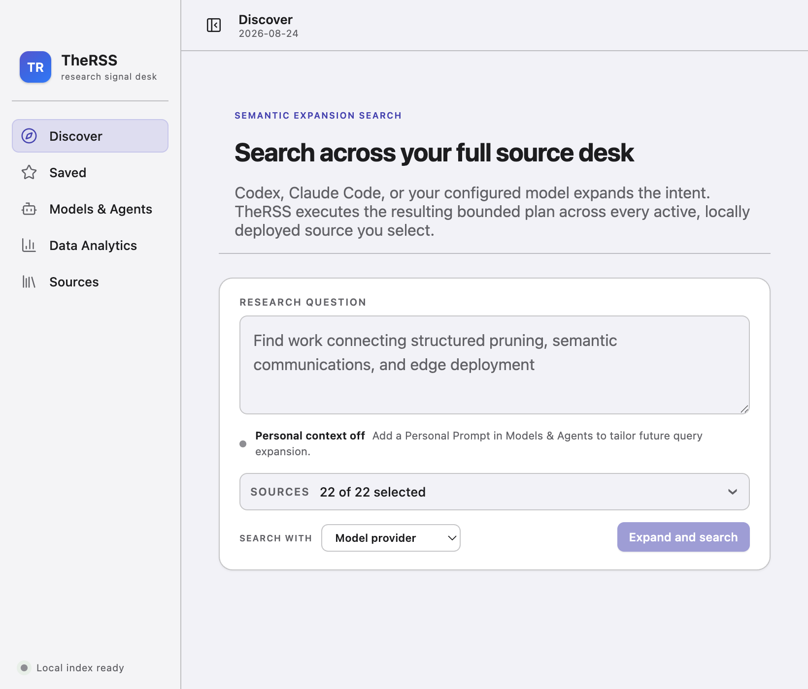
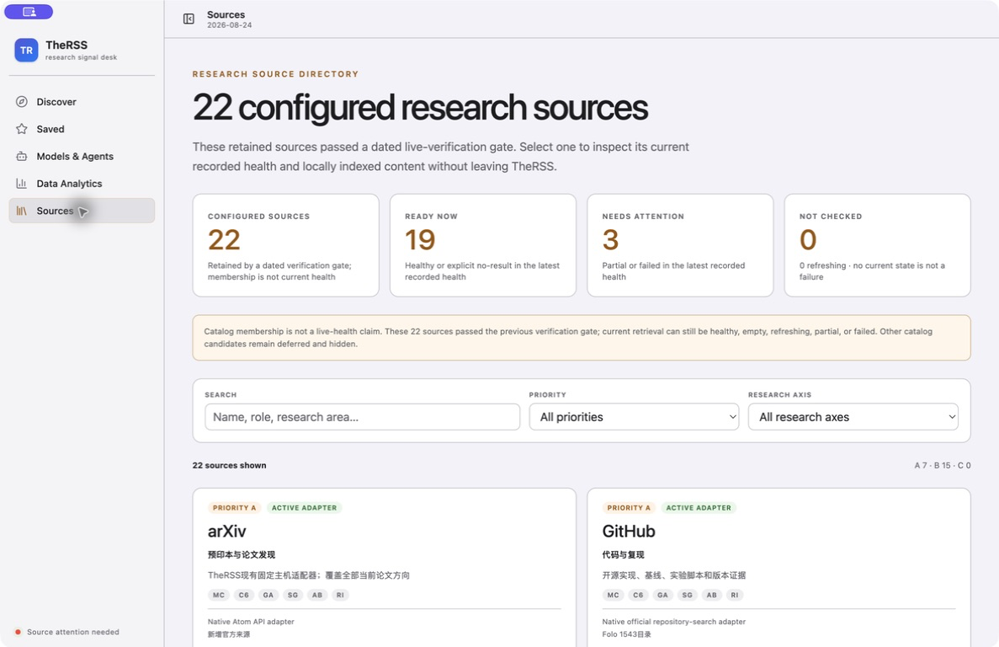
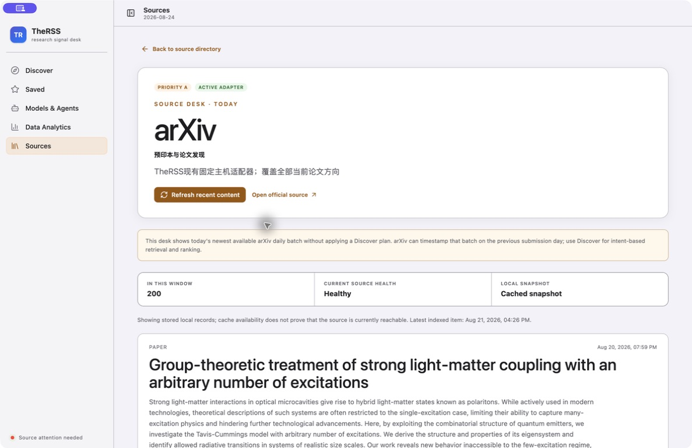
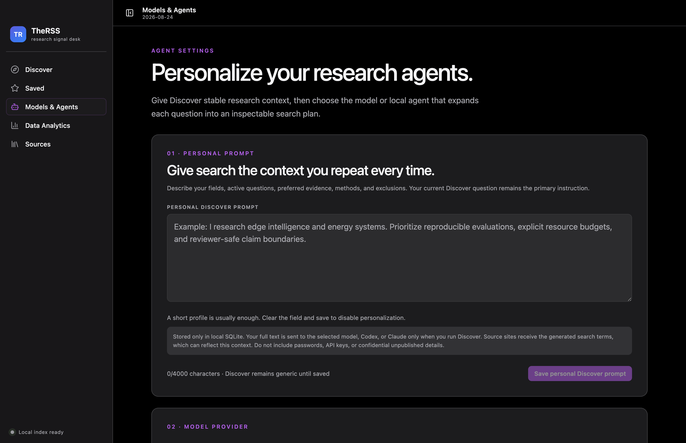
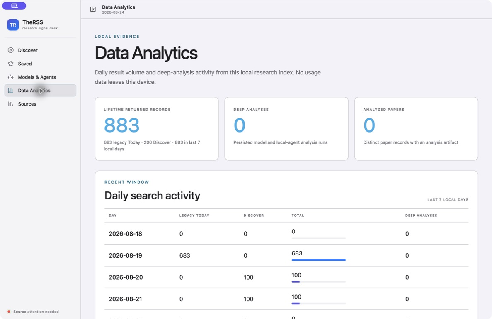

# TheRSS Design Audit Slice A Implementation Report

Date: 2026-08-24
Status: implemented and verified in the current development build

## Outcome

Slice A resolves the four correctness-and-trust findings without changing SQLite, IPC, network
behavior, or the accepted Apple visual system:

1. The 820 px Discover layout no longer clips `22 of 22 selected`.
2. Sources distinguishes configured membership, current health, cached/fetched snapshot state, and
   local index freshness.
3. Light and dark placeholders use an explicit normal-text-contrast token.
4. Data Analytics distinguishes lifetime returned records from the current seven-local-day window.

## D1 — Minimum-width Discover

At `max-width: 920px`, source selection occupies a complete row. Runner selection and the primary
search action move to the following row while retaining their semantic labels.

## D2 — Source-state truth

The directory is now titled `22 configured research sources`. Its metrics report configured count,
ready state, attention state, and sources without a current check. The boundary copy explicitly says
that catalog membership is not a live-health claim.

Source detail now presents per-source health alongside the local snapshot. Cached records explicitly
state that cache availability does not prove current reachability; the timestamp is labeled as the
latest indexed item rather than the latest request.

## D8 — Placeholder contrast

Inputs and textareas use `--placeholder-label` with opacity `1`. The light role is `#626267` and the
dark role is `#a9a9af`; both exceed 4.5:1 against their grouped field surfaces. Electron E2E also
computes the rendered dark placeholder contrast.

## D9 — Analytics time scope

The leading card is labeled `Lifetime returned records`. Its detail retains the Today/Discover split
and adds the exact count represented by the last seven local days.

## Verification

- Focused GREEN: 47/47 tests.
- Full gate: 49 files / 294 tests.
- Coverage: 90.43% statements, 80.12% branches, 93.86% functions, 93.33% lines.
- Formatting, lint, TypeScript, main/preload/renderer/MCP builds: passed.
- Electron minimum-width E2E: 1/1 passed.
- Electron full desktop E2E: 1/1 passed.

## Scope Boundary

This report covers Slice A only. Discover result-density, Saved sticky actions, navigation/Settings,
provider connection testing, source terminology cleanup, high-contrast mode, and renderer file
decomposition remain in later slices. The installed `TheRSS Dev.app` was not replaced in this work.
