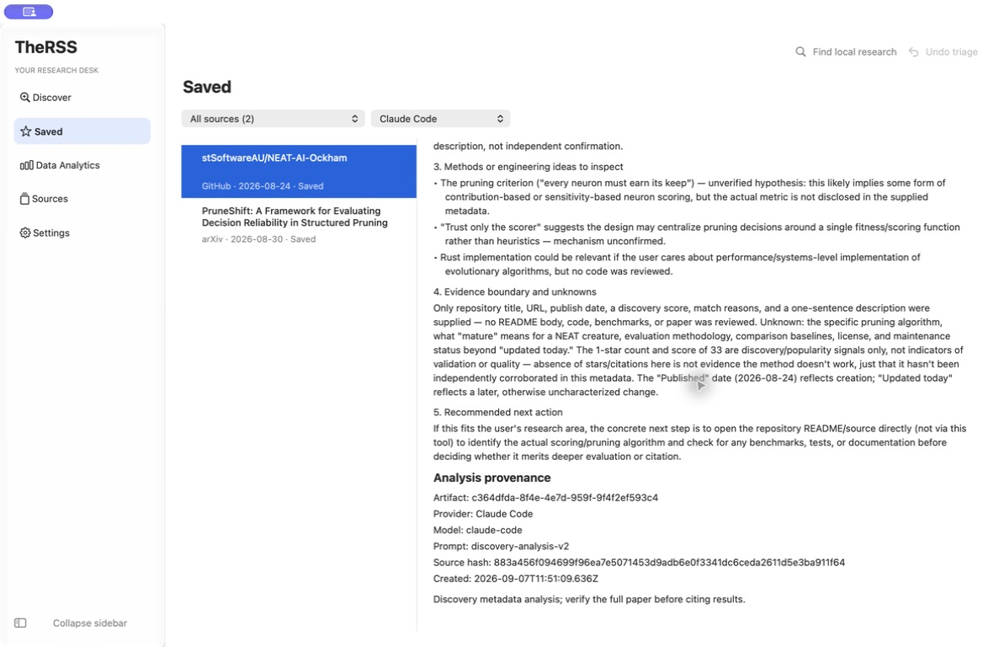

# 非发行验收收尾

## 当前授权与范围

用户要求完成来源可靠性、真实业务全流程、其他执行端及辅助功能/独立人工验收。Apple 付费注册、签名、公证和正式软件发行继续暂缓。用户随后选择先测现有 Codex/Claude，不新增付费 API；自定义模型在用户提供配置后另验，不能用假服务替代真实提供方验收。

2026-09-07 用户随后明确要求“不用设置 VoiceOver”。VoiceOver 项目按用户选择暂缓；系统开关检查为 off，未执行开启或配置写入。继续普通键盘操作检查。VoiceOver 工具启动未取得可用应用的尝试不计作验收通过。

采用固定公开研究问题和公开来源记录，使用生产服务与独立本地数据目录；不读取其他应用的凭据，不向模型发送真实私人研究背景，不写入用户的 llm-wiki。每个现有 CLI 首先限定一次规划及一次分析，超时/失败先诊断，不盲目重发。

## 完成标准与停止条件

| 项目        | 必须取得的证据                                                                                                       | 当前状态             |
| ----------- | -------------------------------------------------------------------------------------------------------------------- | -------------------- |
| S1 来源     | 一次当前全量有界来源检查，逐一记录成功/失败/部分结果；对可复现缺陷修复后做针对性确认；保留持续外部故障的明确降级状态 | 修复通过，外部降级   |
| S2 真实流程 | 公开问题的真实检索和分析、保存与重开；保留来源、runner、提示版本、源哈希、输出及时间，并审查输出的证据边界           | 已完成               |
| S3 执行端   | Codex 与 Claude 真实调用结果；自定义模型按用户选择暂缓                                                               | 已完成               |
| S4 辅助功能 | 普通键盘输入、选择、对话框返回及退出重开实测；VoiceOver 按用户要求暂缓                                               | 已完成               |
| S5 独立人工 | 由人完成同一验收清单并反馈；助手的检查不能冒充独立人工签署                                                           | 等待用户选择评审安排 |

已通过的本机安装、数据保护、退出修复及 CI 不重复全量运行，除非新代码改动或新失败要求重验。每次尝试在任务目录保留参数、进程/运行标识、结果、原因、清理及下一项最小验证；有明确变更或暂态原因才重试。已确认的不可用外部服务须标明影响和恢复动作，不通过无限重试制造“全绿”。

最终交付必须逐项标明通过、失败、用户暂缓及必须由人完成的部分。只有获得对应真实证据才能关闭该项。

## S1 当前复现与修复验收

当前全量检查中 CNBC 已恢复，智源、麻省理工科技评论和 AIbase 超时。NBER 返回 20 个候选但全部拒绝，首篇官方文章的诊断请求为 HTTP 403；原验收脚本把该状态错误标成 no_posts。统一批次分类规则：零有效条目且存在拒绝为失败，部分有效为 partial，真正空批次才是 no_results/no_posts。来源单独刷新须写入共享健康状态；失败保留已有缓存，日常刷新不能用全部无效的批次清空已有结果。先用实际 SQLite 回归复现这些行为，再修复。

三个超时资讯源改用已实测可访问的官方来源：智源公开列表 API（固定只读 POST）、麻省理工科技评论公开列表 API、AIbase 官方新闻页的服务器渲染列表。保持原来源 ID、文章 URL 身份、22 项目录及排名规则；只采集标题、来源提供的摘要、日期和文章链接，不声称取得全文。API 必须验证成功码和列表结构；AIbase 只解析 JSON 和有界文本帧，不执行脚本，也不采用第三方代码中的令牌。无容器、截断响应和无效日期均不能冒充空列表。中国站点无时区的完整日期按 +08:00 解析，并验证日历有效性。

## S2/S3 真实分析发现与修复验收

首轮 Codex 的论文分析保持 abstract-only/provisional 边界。Claude 仓库分析暴露两个问题：排名实际使用更新时间，却显示 Published today；模型据星标数推断缺乏验证和引用。修正标签为对应 Published/Updated，保持评分不变；通用提示升级到 discovery-analysis-v2，明确日期含义、流行度不能证明质量/成熟度/引用/验证，输入之外的判断须标明未知或待验证。修复后允许对同一公开问题和仓库再做一次 Claude 规划及分析，记录初次缺陷和复测结果；不得覆盖旧分析的来源和提示版本。

复测确认旧 Saved 快照不会由新检索自动覆盖；从新结果重新保存可更新其元数据。但阅读器仅按 ID/会话判断选择变化，可能沿用旧的来源核验状态。新增回归：同 ID 的正文或匹配说明变化时重新核验，屏幕上的来源哈希与分析不一致时必须显示变化；后台对旧 Saved 快照的核验不能冒充当前 Discover 画面的核验。已保存的非论文记录须给出“Open Saved”分析路径，而不是重复要求保存。旧分析正文和来源哈希继续不可变。

## 本轮结果（2026-09-07）

- **S1：技术修复通过，保留外部降级。** 全量批次中 CNBC 已恢复；智源、科技评论、AIbase 切换到官方列表后分别返回 6/10/20 条，均无拒绝。NBER 本轮 20 条全部拒绝，首篇官方文章 HTTP 403；NCPSD 保留 3 条、拒绝 7 条。失败保留缓存且更新健康状态。全量批次与针对性复测各有时间戳，不能合并为“22 个来源当前全绿”。
- **S2/S3：两个现有执行端真实流程通过。** Codex 一次规划/论文分析；Claude 首次规划/仓库分析发现证据问题，修复后再做一次规划/同仓库分析。共 3 次规划、3 次分析。新输出区分创建/更新与流行度/质量；3 个不可变分析、2 条收藏重开后保持一致，数据库完整性正常，未写入 llm-wiki。
- **S4：普通键盘通过，VoiceOver 按用户要求暂缓。** Command-F 聚焦搜索，键入与提交得到本地结果，Escape 返回阅读，方向键同步选择，Command-Q 正常退出并可重开。未修改 VoiceOver 配置。
- **S5：等待独立人工验收。** 已准备 [5 项人工清单](HUMAN_ACCEPTANCE.md)，不能用助手操作和自动化替代真实使用者反馈。

完整检查：630 项主测试、90 项原生专项；对应四项聚合覆盖率均超过 80%。桌面回归 8/8；确切候选包与实际安装后的应用均通过启动和 12 组原生流程。已安装到 `~/Applications/TheRSS Dev.app`，保留本次应用/数据库备份；全部 11 张真实数据表与紧邻安装备份一致，完整性为 `ok`。ASAR 及 5 个主进程/preload/MCP/原生构件与编译结果匹配。

已做单独差异审查：保持原来源与文章身份，新增解析有输入/条目/帧/递归上限且不执行网页脚本；没有新增依赖、凭据、数据库迁移或额外付费提供方。来源查询不会误记为研究检索统计。旧分析不被覆盖，新来源与提示版本均可追溯。

当前包、来源、调用、输出哈希、回归日志哈希及安装核验见 [结构化记录](remaining-verification.json) 和 [包记录](package-verification.json)。原有签名验证属于历史未签名证据，当前用户已明确暂缓正式发行。后续代码交付沿用草稿 PR #49；精确提交和 CI 结果由 [PR 检查页](https://github.com/dtjgp/TheRSS/pull/49/checks) 维护。

