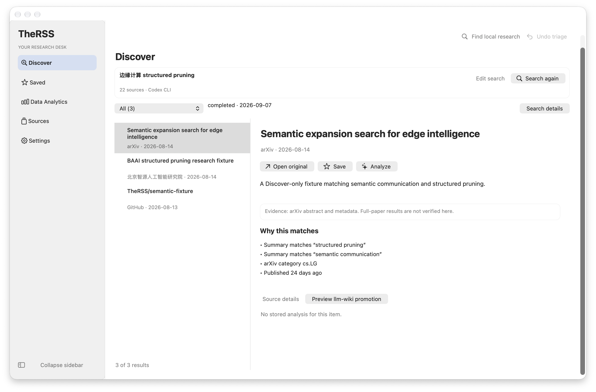
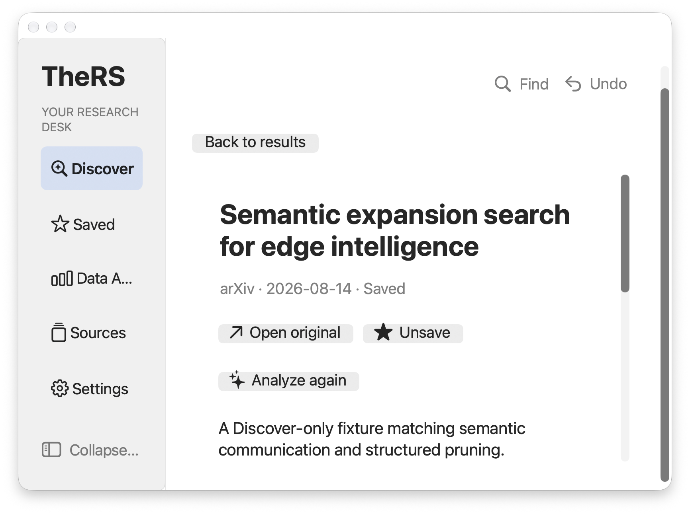
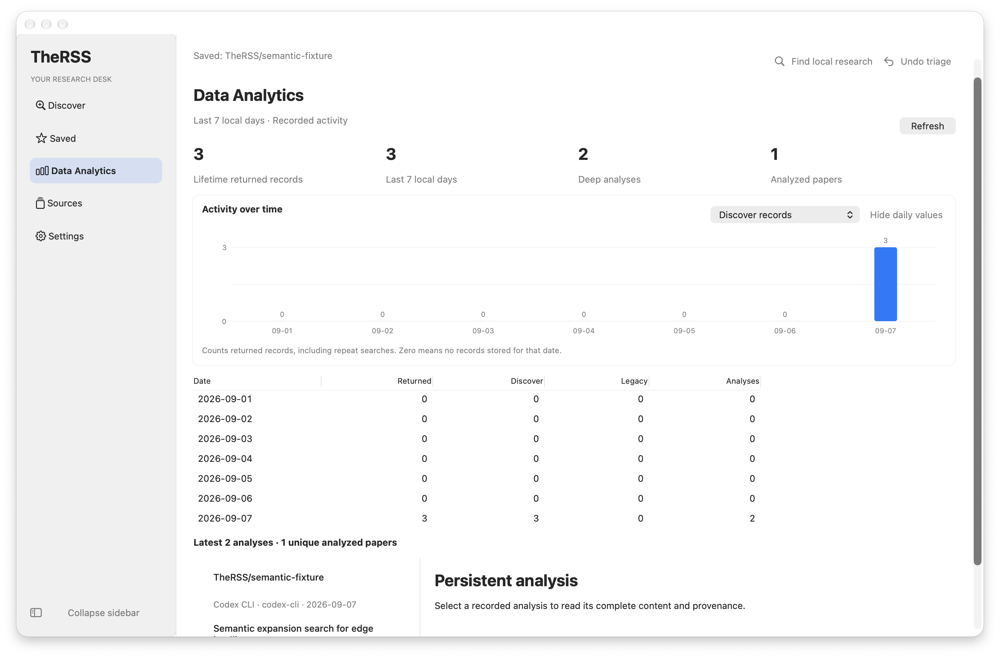

# TheRSS 0.3.0 界面改进与本地验收

**当前非发行技术验收通过，独立人工验收待反馈。** 用户已暂缓 Apple 付费发行、自定义付费 API 和 VoiceOver。真实 Codex/Claude 规划与分析、保存重开、来源修复和普通键盘检查已完成，修复版再次安装并验证 11 张真实数据表与安装前备份一致。详见 [本轮收尾](REMAINING_ACCEPTANCE.md)、[结构化证据](remaining-verification.json) 与 [人工清单](HUMAN_ACCEPTANCE.md)。源码交付沿用 [草稿 PR #49](https://github.com/dtjgp/TheRSS/pull/49)，未合并或正式发行。

A1–A9 改动已实现并通过自动化和实际 AppKit 检查。完整要求保留在 [改动契约](CHANGE_CONTRACT.md)，当前结果在 [验证记录](verification.json)；签名市场发行与本轮本地验收分别记录。

## 用户可见改动

- 通知固定在工具栏，收藏、撤销和提示关闭不再推移阅读区；错误保留至关闭，状态通过原生辅助功能通知。
- Search 与 Analyze 的不可用原因提供对应恢复入口；来源选择支持搜索和分组，保留研究问题及选择。
- 阅读区把分析、收藏、原文放在摘要前，次要元数据按需展开；保留完整原文、来源和分析证据边界。
- 窄窗口切换为单窗格阅读，返回时保留结果选择、列表位置和正文位置；宽窗口保留独立可调窗格。
- 本地搜索可打开准确的收藏、历史检索记录和不可变分析；返回时恢复先前问题，缺失与过时状态分别提示。
- 设置提供字段内错误、焦点定位、明确的保存与凭据清除层级，以及可展开的连接测试详情。
- 空列表与过滤无结果都有恢复动作；Analytics 使用实际原生数值列，验证了千行表格的可见单元格和滚动。

## 可靠性与安全修复

arXiv 解析拒绝 HTML、错误文档、非法 XML 和不支持的声明，将真实空结果与失败区分；作者和聚合元数据有界，兼容旧论文编号和大型合作组。生产请求共享可取消的三秒间隔队列。配置来源的重定向在跟随前检查 HTTPS 同源限制，并沿用整体超时；来源失败保留缓存并同步显示故障。

取消本地代理任务会终止它的进程组，随后清理忽略 SIGTERM 的进程；主进程先退出并关闭管道也不会取消对子孙进程的强制清理；回归用真实子进程验证退出，未借此调用用户模型账号。安装器验证文件、权限位和符号链接构成的整包指纹，拒绝覆盖运行中的应用，保存应用及数据库备份，并验证替换和失败回滚。新发布验证器实际检查 Developer ID、Hardened Runtime、公证票据、Gatekeeper、团队身份及后继版本，未签名包会失败。

本机验收还复现并修复了 Command-Q 只关闭窗口却留下主进程的问题。回归从隔离原生事件循环投递实际快捷键，在修复前失败；把最终退出请求延后一个事件循环后通过，并在真实已安装应用上确认主进程及助手全部退出、随后正常重开。

Node 26 的宿主 Web Storage 遮蔽 jsdom 存储曾造成 41 项测试失败。仅对测试 worker 禁用宿主 Web Storage 后，真实 jsdom Storage 断言保持有效；CI 增加 Node 24 与 26 顺序检查。未改变产品存储能力。

## 验收矩阵

| 要求 | 状态                       | 当前证据与边界                                                                                      |
| ---- | -------------------------- | --------------------------------------------------------------------------------------------------- |
| A1   | 通过                       | 通知几何、焦点、撤销及原生 announcement 检查；错误不自动消失                                        |
| A2   | 通过                       | 查询、来源、runner 恢复回归与真实首用路径；无隐式提交                                               |
| A3   | 通过                       | 操作顺序、完整 Unicode 正文、证据展开、分析加载竞争及实际截图                                       |
| A4   | 通过                       | 宽窄窗口、820×600、150% 字体、键盘及千行列表/长正文位置恢复                                         |
| A5   | 通过                       | SQLite 精确查询、API/IPC 边界、历史记录与分析打开和返回测试                                         |
| A6   | 通过                       | 来源/日期/状态顺序、长标题、完整元数据及未改变排序语义                                              |
| A7   | 通过                       | 字段错误和焦点、中文输入组合、密钥有序回调、草稿与关闭确认                                          |
| A8   | 通过                       | 空状态、无匹配过滤、错误重试和原生键盘激活                                                          |
| A9   | 通过                       | 跨页截图、来源成员一致性、数值列实际可见性和原始值一致性                                            |
| R1   | 通过                       | `npm run check`：92 文件/630 测试；AppKit 专项 21 文件/90 测试；桌面 E2E 8/8                        |
| R2   | 通过                       | 安全回归、密钥模式扫描及 npm audit 零漏洞；私密漏洞报告已开启                                       |
| R3   | 本地验收通过               | 真实安装、11 张表与本次安装前备份完全一致、正常退出/重开、12 组原生流程及隔离升级回滚通过           |
| R4   | 连通验证通过；来源边界保留 | Codex/Claude 真实规划分析与重开通过；三个官方资讯列表已恢复，NBER 失败、NCPSD 部分；自定义 API 暂缓 |
| R5   | 按用户要求暂缓             | 签名、公证、Gatekeeper 和签名更新留待正式分发阶段，不作为本轮本机验收门槛                           |
| R6   | 本地文档与操作验收通过     | 五个主要页面、本地查找往返、执行方式、退出重开已检查；不声称全面人工/VoiceOver 或旧系统认证         |
| R7   | 已推送并创建草稿 PR        | 草稿 PR #49 指向 main；当前远端提交及 CI 结果见 PR 检查页，未合并或发布软件                         |

主覆盖率（语句/分支/函数/行）：90.81% / 81.65% / 94.35% / 93.55%。AppKit 专项：89.01% / 81.96% / 88.42% / 91.46%。这是项目规定的各自聚合范围，不能解释为每个文件都超过 80%。实际测试环境为 Apple Silicon、macOS 27.0（26A5425a）、Node 26.7.0、Electron 44.1.1。macOS 26+ 原生路径与同机 Web 回退均有运行证据；旧系统整机验证仍未做。

**历史来源记录：** 检查完成于 2026-09-07 01:54 UTC，超时来源为 `folo:302`、`folo:182`、`folo:93`、`folo:67`、`folo:253`；`folo:611` 返回 3 条并拒绝 7 条。详情见 [来源验证](source-verification.json)。这次检查不能支持“22 个来源全部健康”的说法。

2026-09-07 02:08 UTC 后续修复：OpenAI 的同一来源 `folo:182` 改为 [官方 RSS](https://openai.com/news/rss.xml)，生产客户端在 430 ms 内完整读取 712,661 字节，按既定上限规范化 100 条，拒绝 0 条。来源身份、排序规则及 100 条上限保持不变，来源访问说明更新为官方端点。独立 curl 也复现了旧镜像的部分传输超时。其余四个镜像来源未确认恢复；CNBC 官方候选返回 403，未采用。该复测没有被合并成一次新的全量健康结论。

2026-09-07 本轮全量与定点收尾：CNBC 已在全量检查恢复；智源、科技评论、AIbase 改为官方列表后分别实测 6/10/20 条，拒绝均为 0。NBER 全部 20 条拒绝，首篇官方文章为 HTTP 403；NCPSD 3 条有效、7 条拒绝。修复批次状态分类与缓存保护，来源单独浏览不污染检索统计。全量与定点复测使用各自时间戳，见 [本轮证据](remaining-verification.json)。

真实 Claude 输出暴露了把更新日标为发布日、从星标数推断验证程度的问题。日期标签和通用提示 v2 已修正；旧分析继续不可变。原生阅读器还修复了同一 ID 内容更新时的来源状态缓存，以及当前阅读快照与旧 Saved 快照的哈希比较；不再把旧核验误称为当前来源未变化。

## 审查与恢复

实现后在主会话执行了单独 diff review，检查产品范围、状态竞争、来源完整性、IPC/存储、密钥、子进程和安装恢复。由审查发现的错误 feed 分类、取消进程残留、原生表格视口和宿主存储问题均已修复并重新验证。这不等于外部审阅者或用户完成了黑盒验收。

没有新增数据库迁移。升级演练使用临时 Applications 和独立 SQLite，写入研究背景、检索、收藏和分析后核对所有表；见 [升级回滚记录](upgrade-verification.json)。真实用户应用现已再次完成备份安装，11 张数据表与本次安装前备份完全一致，数据库完整性为 `ok`。安装须使用 [本地更新流程](../../LOCAL_UPDATE.md)，保留其回执定位的旧应用和数据库；不要在应用运行时覆盖数据库。

此前的本机安装和 CLI 授权阻塞已由用户明确批注授权解决，相关验证现已通过。GitHub 私密漏洞报告曾再次被自动审批按本地范围拒绝；直到用户随后独立要求执行 GitHub 操作，才开启私密报告、推送源码并创建草稿 PR，未绕过先前拒绝。

最终候选的主进程、preload、MCP 和两个原生模块均与编译输出哈希一致，且该确切包通过启动和 12 组 AppKit 工作流。见 [包验证](package-verification.json)。[PR 文本](PR.md) 已用于创建草稿 PR #49；本机安装和源码分支推送均已完成。

## 后续正式分发阶段

本轮技术收尾已完成；独立人工验收仍需真实使用者反馈。后续按用户决定补充自定义模型 API、VoiceOver、其他系统实机验证，并在恢复正式分发后处理 Apple 签名、公证和同身份升级。NBER/NCPSD 的来源降级保持明确，不能宣称所有来源始终可用。
