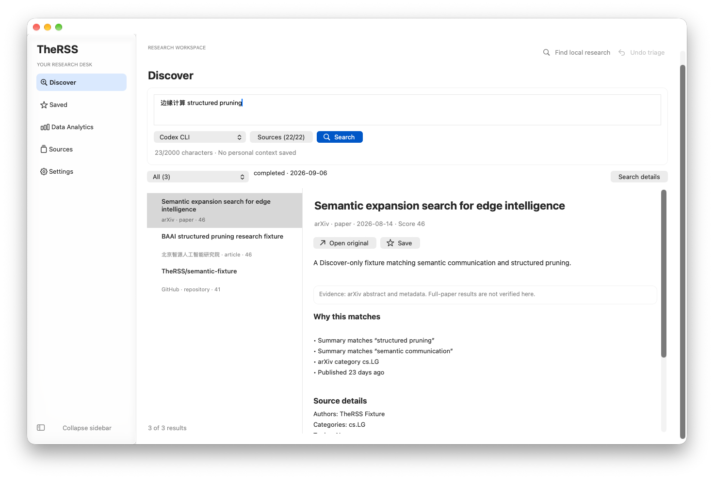
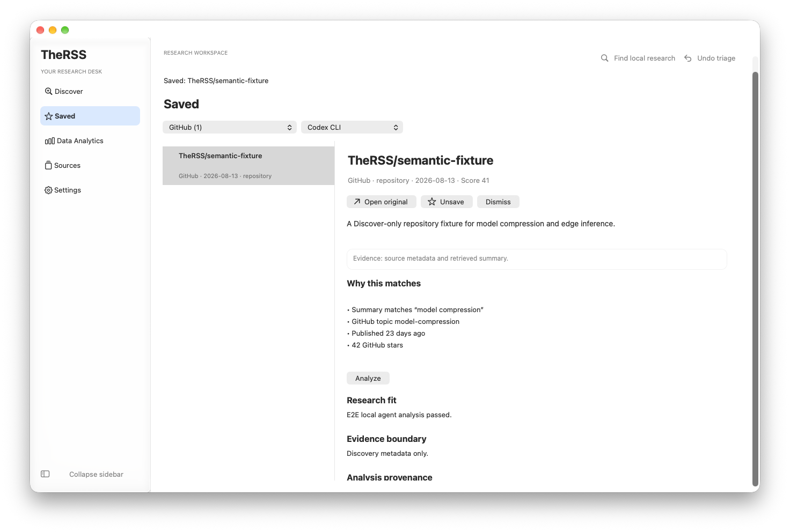
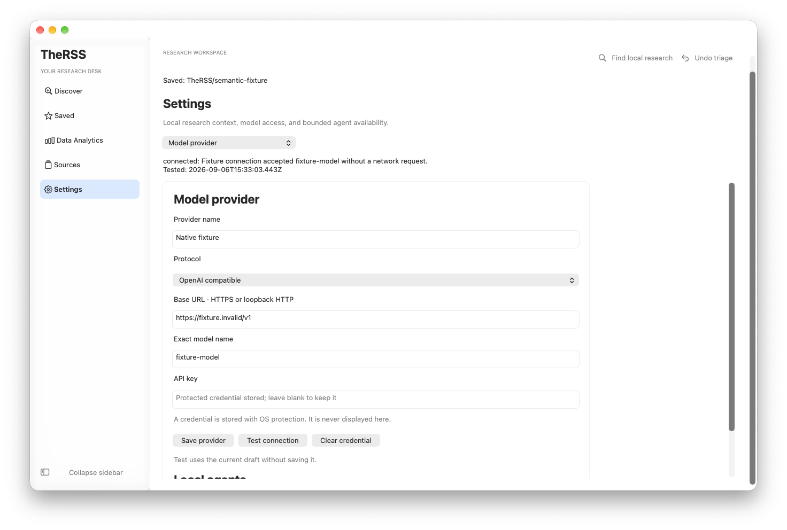
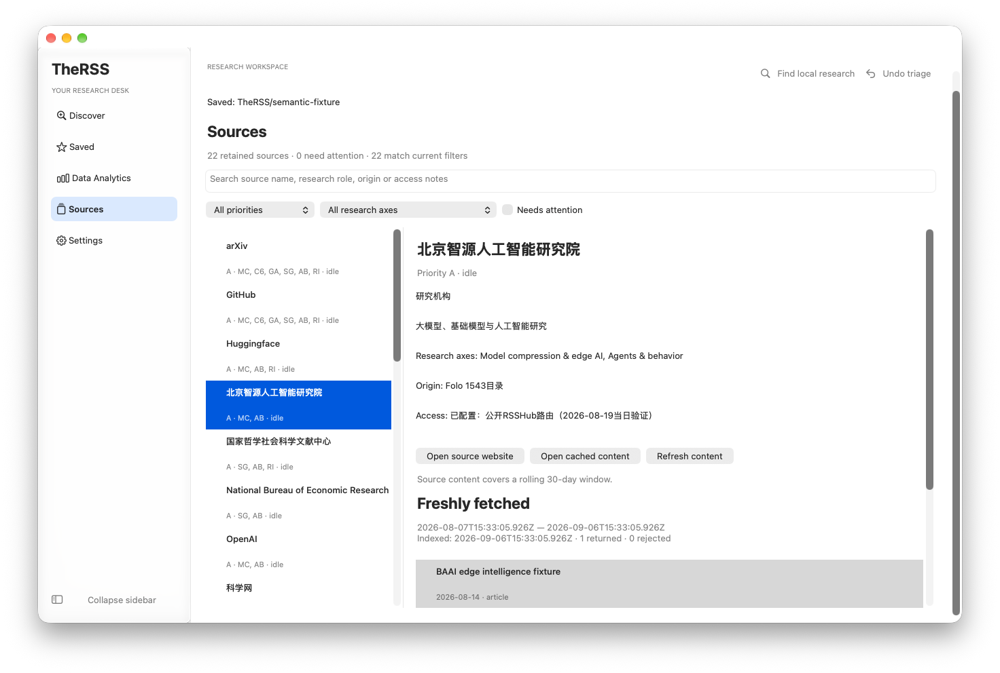
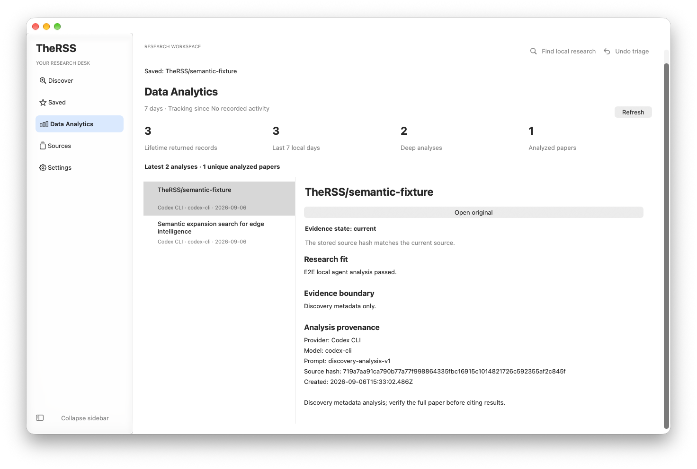
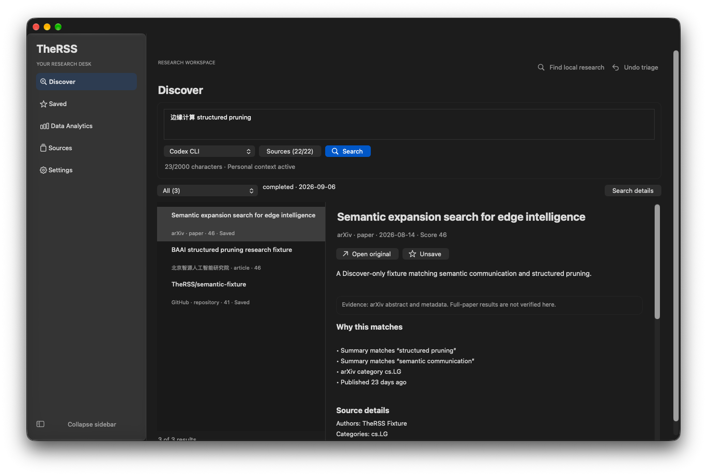

# TheRSS UI 质感评估与改进

本文记录第一轮视觉改进。后续的交互、安装与 GitHub 同步由 [后续完成记录](../2026-09-06-ui-workflow-completion/CHANGE_CONTRACT.md) 跟踪。

当前界面的主要问题是视觉层级不够清晰：导航、主要动作、辅助动作过于相似，列表的大面积灰底偏重，阅读和设置页面的间距缺少统一规则。本次沿用精致、克制的 macOS 科研工作台方向，已在当前默认的 AppKit 界面落实一轮改进。

改前截图来自本次检查的已安装应用；改后截图来自同一代码库的独立原生测试窗口，使用明确的固定测试数据。数据量和窗口状态不同，因此这些图片用于解释设计变化，不作为扫描效率的量化对照实验。

## 主要问题与处理

| 优先级 | 原有问题                                     | 对使用体验的影响                       | 本次处理                                                                                 |
| ------ | -------------------------------------------- | -------------------------------------- | ---------------------------------------------------------------------------------------- |
| 高     | 侧栏是一组居中的普通灰色按钮                 | 导航与页面命令缺少区分，当前位置不突出 | 原生系统图标、左对齐文字、浅强调色选中背景、选中项字重；高对比度模式保留明确轮廓         |
| 高     | Search 与 Sources、Search details 同等显眼   | 核心操作没有清楚的视觉重心             | 将输入与运行选项归入一个轻边界面板，Search 使用强调色，辅助工具减弱背景                  |
| 高     | 结果区大块灰底，论文标题容易显得拥挤或被截断 | 很难快速扫读多个研究条目               | 更轻的原生列表背景；标题与元数据分层；明确两行标题几何，完整标题仍可在阅读区或提示中查看 |
| 中     | 正文、证据提示、来源信息像连续堆叠的控件     | 阅读缺少节奏，证据说明不容易定位       | 正文 14pt，统一阅读边距，证据提示单独成块；“展开摘要”恢复为紧凑辅助操作                  |
| 中     | 设置表单与分区选择器横向铺满窗口             | 宽屏上的表单显得松散，输入路径过长     | 表单宽度最多 800pt、分区选择器 250pt，统一分组边界和内间距                               |

本次保留系统字体、原生列表选择、分隔条、文本编辑、复选框和确认框。没有增加字体、图标包、动画库或图片依赖。系统符号由 AppKit 提供，文字标签仍然保留。

## 逐步界面检查

1. **Discover：已改善，原生流程通过。** 输入与主要动作现在构成一个明确区域，结果与阅读区分工更清楚。

   改前的本机用户数据截图只在本地保留；公开证据使用下方固定测试数据截图。

   

2. **Saved：已改善，收藏与分析路径通过。** 复用两行列表、阅读排版和证据区块；收藏/取消收藏、撤销和分析语义保持原样。

   

3. **Settings：已改善，原生表单与安全输入通过。** 内容宽度受到约束，设置分区不再横贯整页。密码控件、保存、丢弃草稿和中文输入法测试继续通过。

   

4. **Sources：共享样式已改善，筛选与打开来源通过。** 列表更轻，标题层次更稳定。来源数量、状态、时间和访问说明全部保留。

   

5. **Data Analytics：共享样式已改善，历史记录打开通过。** 受益于侧栏、列表和文本间距统一；本次未重新设计统计指标或添加图表。

   

## 深色与可访问性

- 检查了浅色、深色、提高对比度、减少透明度、窄窗口和 1.5 倍缩放。
- 检查了蓝、黄、橙、紫、灰五种进程内测试强调色，没有修改系统外观设置。AppKit 的有色按钮实际绘制白字，因此最终方案调整背景亮度来维持对比度，不能仅凭指定的文字颜色推断渲染结果。
- 实际截图中的蓝色和黄色主按钮背景采样对白字的对比度分别约为 6.59:1 和 7.09:1；这是特定截图区域的检查，不代表整个应用通过可访问性认证。
- 两行标题验证读取真实控件尺寸，在 260pt 列表宽度及 1.5 倍缩放下检查两行文本空间；不只检查配置写了“两行”。
- 输入框继续采用系统原生边框，由 AppKit 处理外观切换。没有增加动态效果。
- 未完成完整 VoiceOver 人工巡检，极长标题仍受两行扫描区限制；完整内容在阅读区保留。

## 仍值得推进的产品设计

这些是后续交互设计建议，本次没有混入新的功能或信息架构：

1. **结果出现后收紧搜索区。** 当前搜索区始终占据顶部空间，窄窗口和放大字体时，阅读区域仍要借助外层滚动。适合下一轮做可恢复的紧凑搜索栏原型，验证编辑、取消和重试路径。
2. **来源选择器按研究用途组织。** 22 个复选框可以进一步按论文、代码、机构与行业信息分组，并明确缺少运行器等搜索前置条件。
3. **统计页强调时间变化。** 在保留现有计数定义的前提下，用真实历史数据呈现趋势；没有记录时显示明确的空状态，不添加装饰性数据。

## 验证与交付边界

- `npm run check`：主测试 554 项，原生控制器与窗口边界测试 61 项；架构、格式、lint、类型、覆盖率与构建通过。主测试四维覆盖率 90.76 / 80.70 / 94.09 / 93.59%，原生范围 91.20 / 82.61 / 90.46 / 94.26%。
- 真实原生验收：12 组工作流、5 组控件检查通过；包括来源选择、搜索、阅读、收藏、设置、历史分析、本地查找、确认框、中文输入、缩放和窗口重建。
- 兼容界面核心端到端测试：`e2e/desktop.spec.ts` 1 项通过。
- 独立只读审查提出的强调色、输入边框、复选框隔离和标题验证问题均已处理。首次关闭确认框测试的等待竞态已按真实确认框完成事件修正；生产关闭逻辑未改。
- 原始运行记录在 `test-results/ui-craft/`；关键截图与哈希保存在本目录的 `verification.json`。
- 改动已落实到本地源码，未提交或推送 Git，未替换已安装应用，未进行打包发布或真实模型、来源、笔记库写入。
