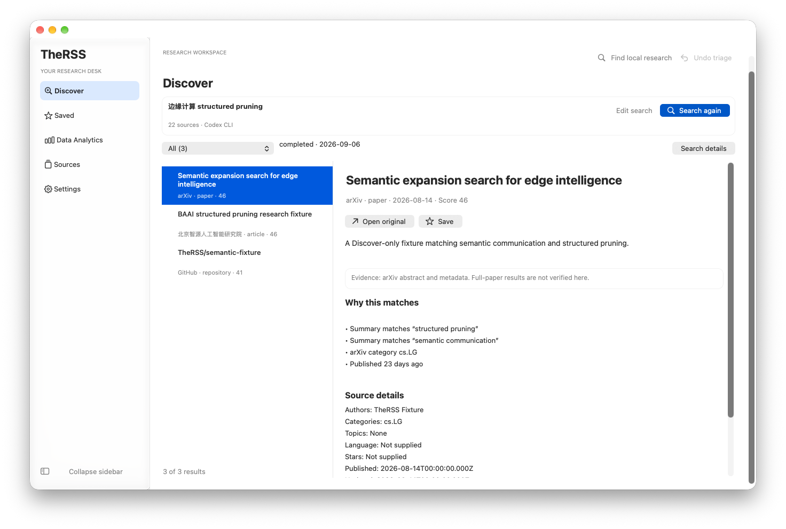
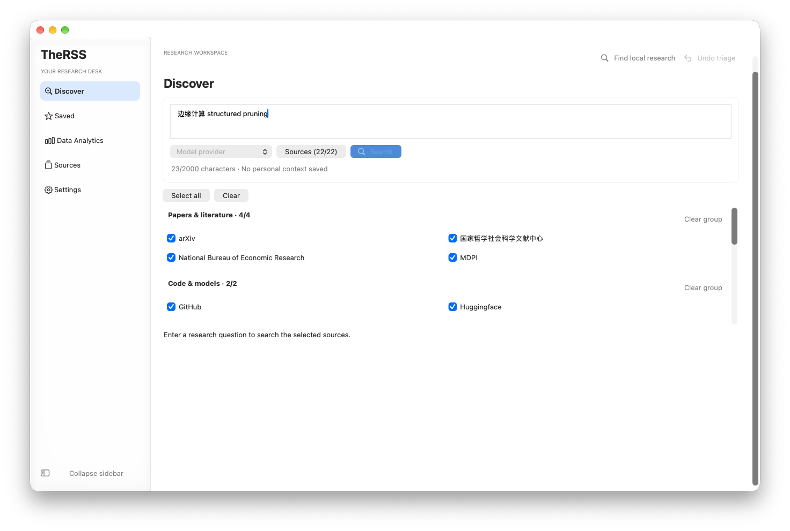
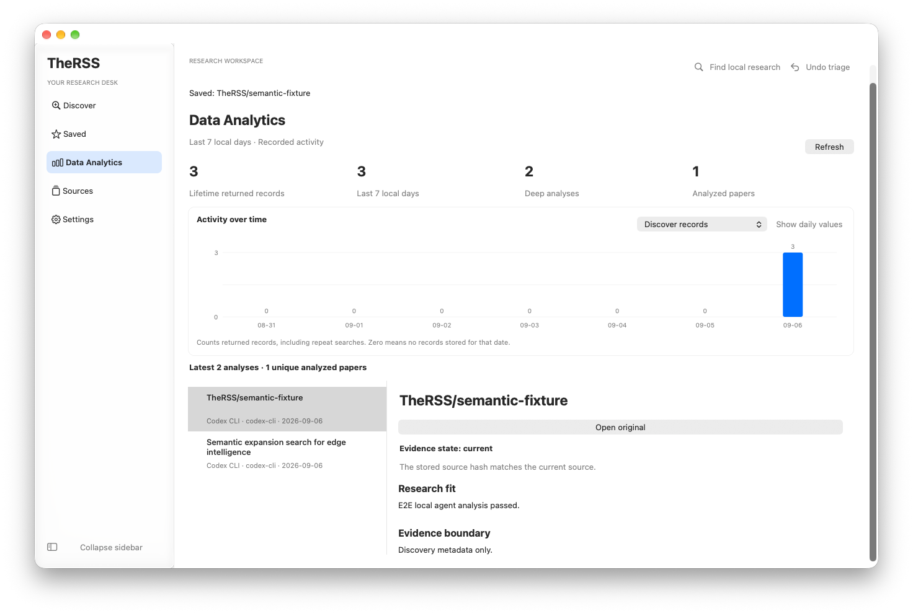
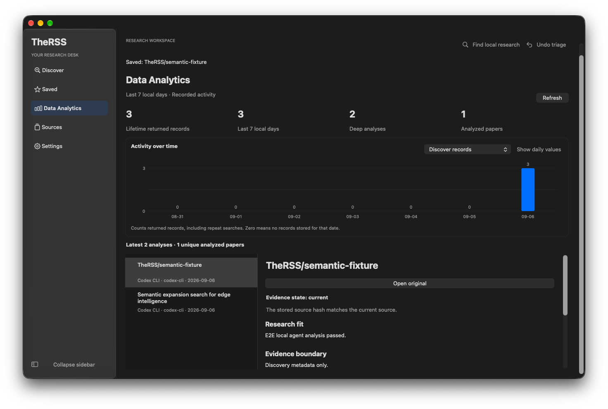

# Native research workflow delivery

The follow-up implements all three requested interactions and the preceding native UI refinements.

- **Compact search:** restored and completed/partial result-bearing searches use a compact query summary. Editing restores the full draft and keyboard focus. Unsubmitted changes remain explicitly separate from the persisted result intent; failed, canceled and empty runs keep recovery controls.
- **Source groups:** all 22 sources belong to five presentation groups. Discover supports individual and group selection; Sources offers the same group filter. Filtering does not fetch data.
- **Real-history trends:** native bars use the existing seven local-date SQLite aggregates, with separate Discover, legacy Today and analysis series. Zero values have zero bar height, exact daily values remain available, and empty history is stated explicitly.

The following captures use isolated deterministic fixtures, not live search results or personal research data.

## Verification

| Gate                                                       | Result                                           |
| ---------------------------------------------------------- | ------------------------------------------------ |
| Main tests                                                 | 83 files / 562 tests passed                      |
| Native controller tests                                    | 16 files / 68 tests passed                       |
| Main coverage: statements / branches / functions / lines   | 90.77 / 80.70 / 94.12 / 93.60%                   |
| Native coverage: statements / branches / functions / lines | 91.80 / 82.64 / 90.44 / 94.80%                   |
| Architecture, format, lint, types, builds                  | Passed                                           |
| Complete desktop E2E                                       | 6/6 passed                                       |
| Native workflows                                           | 12/12 groups passed                              |
| Native controls, chart ratios and label bounds             | 6/6 groups passed                                |
| Dependency audit                                           | Zero vulnerabilities                             |
| Packaged default native and compatibility entry points     | Passed                                           |
| Installed application smoke                                | Passed, including 12 native workflow groups      |
| Independent diff review                                    | Findings resolved; no remaining actionable issue |

Native appearance coverage includes light/dark, increased contrast/reduced transparency, five
accent colors and 820px windows at 1.5x zoom. Chart contrast uses the actual panel background,
separately from button styling. Graphs expose full date/value/unit information to accessibility;
this is not a claim of complete VoiceOver compliance.

## Installation and recovery

The verified unsigned personal build was installed on 2026-09-06 at 18:57:27 UTC using the existing
recoverable installer. The previous application and database backup were retained. Both databases
passed integrity checks; their research-record, session, result and analysis counts matched.
The installed `app.asar` and both native modules match their packaged files exactly; hashes are
recorded in [install-verification.json](install-verification.json).

The application target is `~/Applications/TheRSS Dev.app`. Its receipt is
`install-2026-09-06T18-57-27-998Z.json` in the existing TheRSS installation-receipt directory.
No live model/source calls, real vault writes, credentials changes, release tag or GitHub Release
are part of this delivery. The public repository update uses the protected-main PR workflow and
its required `quality` and `desktop` checks.
